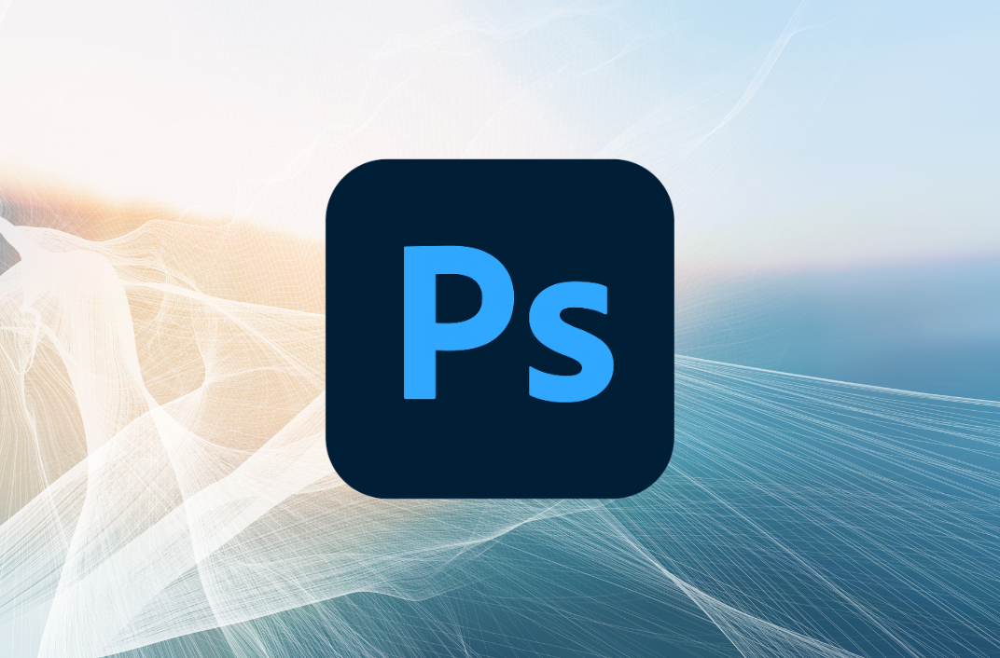
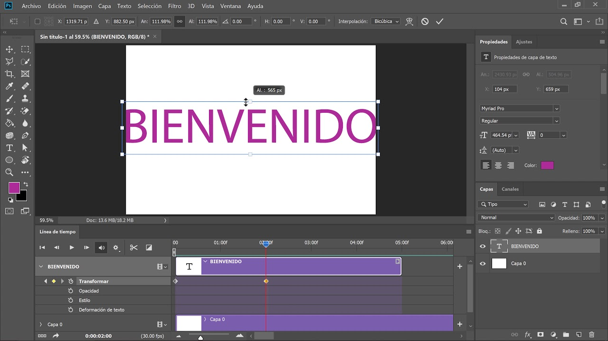

# Photoshop-eko Denbora-lerro Tresna

- [Photoshop-eko Denbora-lerro Tresna](#photoshop-eko-denbora-lerro-tresna)
  - [Zer da?](#zer-da)
  - [Zer da Denbora-lerroa?](#zer-da-denbora-lerroa)
  - [Zer egin daiteke Denbora-lerroarekin?](#zer-egin-daiteke-denbora-lerroarekin)
  - [Zein da bere funtzio nagusia?](#zein-da-bere-funtzio-nagusia)
    - [1. Frame Animation](#1-frame-animation)
    - [2. Video Timeline](#2-video-timeline)
  - [Zergatik da erabilgarria?](#zergatik-da-erabilgarria)
  - [Ondorioa](#ondorioa)

## Zer da?

Photoshop-eko Denbora-lerro tresna (Timeline Tool) animazioak eta bideo-mugimenduak sortzeko erabiltzen den funtzio bat da. Irudi estatikoak erabiltzen dituen Photoshop-etik harago, tresna honek aukera ematen du objektuak denboran zehar mugi daitezen, efektuak alda daitezen edo fotograma-segida animatu bat sor dadin.

## Zer da Denbora-lerroa?

Denbora-lerroa pantailaren behealdean agertzen den panel bat da, eta bertan ikus daiteke irudi edo elementu bakoitza denboran nola kokatzen den. Marrazkiak, geruzak eta efektuak denbora-barra baten moduan antolatzen dira.

Hau da, Photoshop-en barruan "mini-edizio programa" bat bezala funtzionatzen du, baina animazio sinple eta arinetarako.

## Zer egin daiteke Denbora-lerroarekin?

Denbora-lerroak aukera ematen du:
- GIF animatuak sortzeko 
- Objektuak mugitzen animazio sinpleetan  
- Opakutasun aldaketak eta fade-ak egiteko  
- Testuarekin animazio txikiak sortzeko  
- Bideo klip laburrak moztu edo antolatzeko 
- Audio pista bat gehitzeko (oso oinarrizko moduan)

##  Zein da bere funtzio nagusia?

Bere funtzioa da irudi edo geruza bakoitzari denboran iraupena eta mugimendua ematea.  
Bi modu nagusi ditu:

### 1. Frame Animation
- Fotograma bereiziak, GIF estiloko animazioak egiteko.

### 2. Video Timeline
- Mugimendu leun eta progresiboak sortzeko, keyframe bidez.

## Zergatik da erabilgarria?

- Photoshop erabiltzen duten pertsonek programa bakar batean irudia + mugimendua sortu dezaketelako.  
- Webguneetarako GIF animatuak sortzea oso erraza delako.  
- Mugimendu sinpleak egiteko ez delako behar After Effects edo Premiere bezalako programa konplexurik.

## Ondorioa

Photoshop-eko Denbora-lerroa animazio eta bideo arinak sortzeko tresna integratua da. Ez da edizio profesionalerako diseinatua, baina aukera bikaina da GIFak, mugimendu txikiak eta edizio sinpleak egiteko, Photoshop-en ingurune ezagun eta erosoan bertan.

--- 

[Tutoriala](https://helpx.adobe.com/es/photoshop/using/creating-timeline-animations.html)