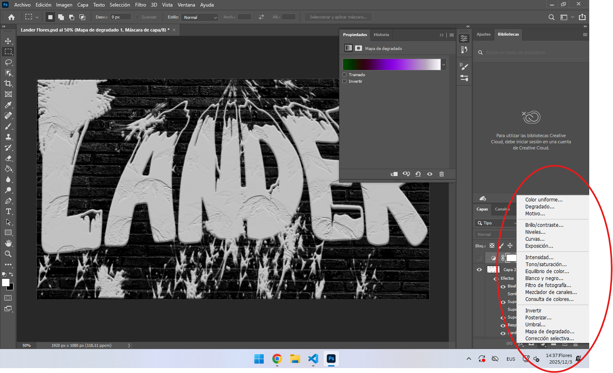
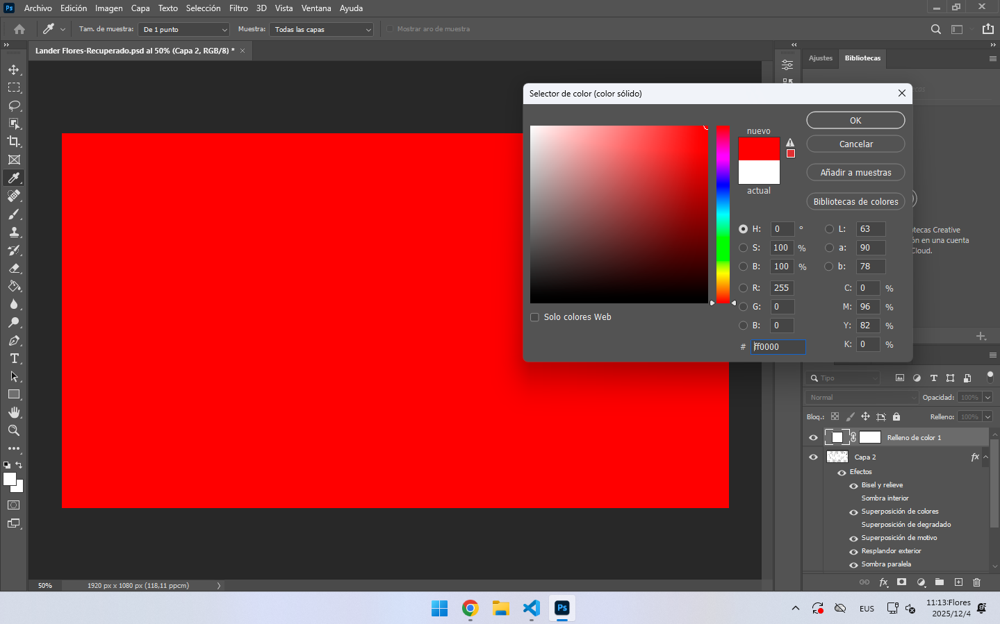
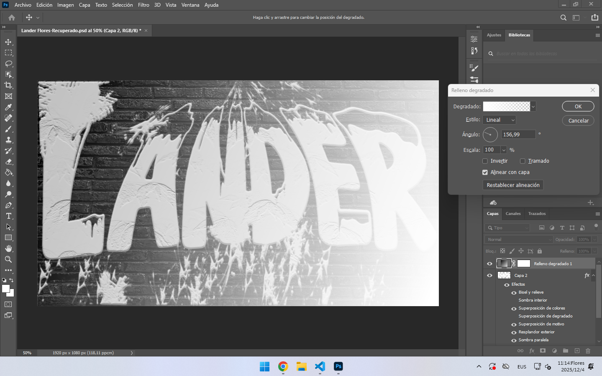
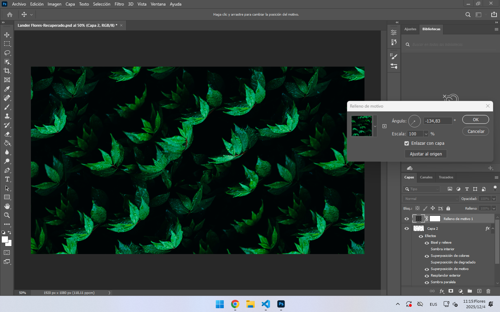
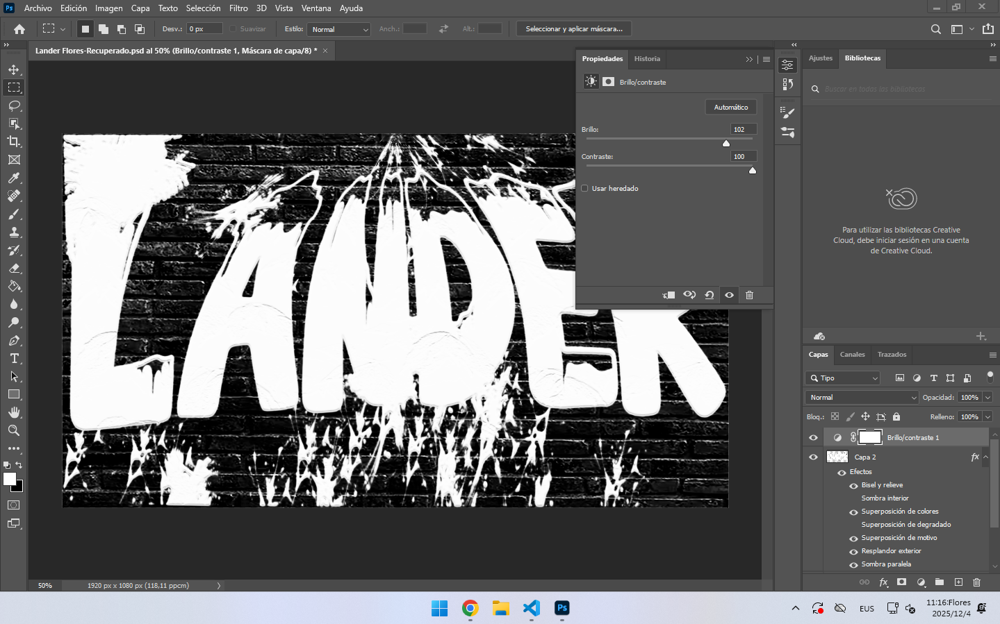
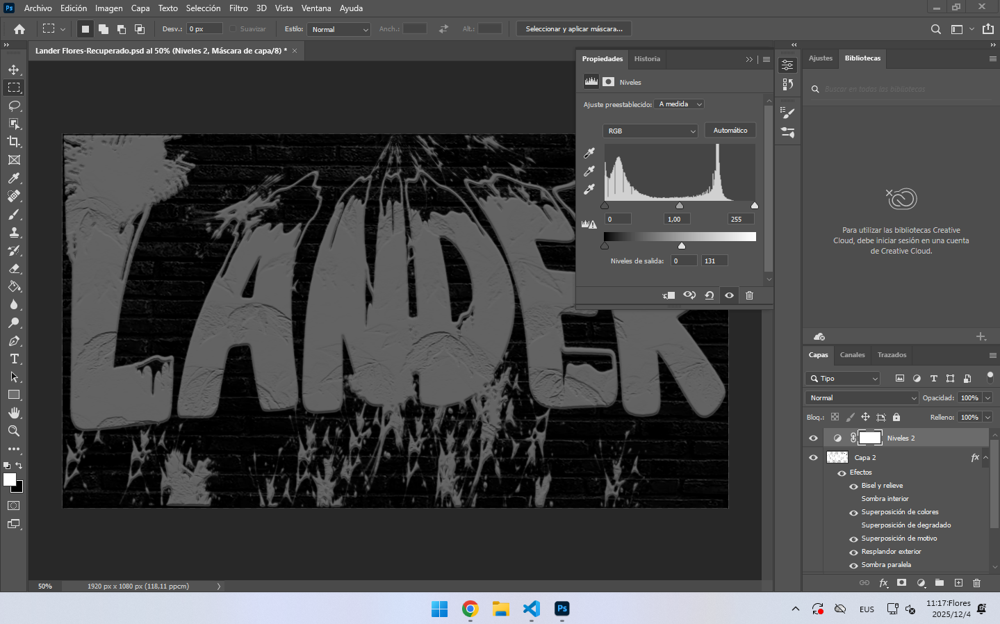
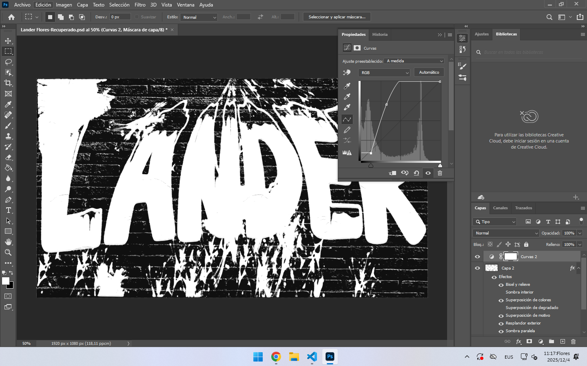
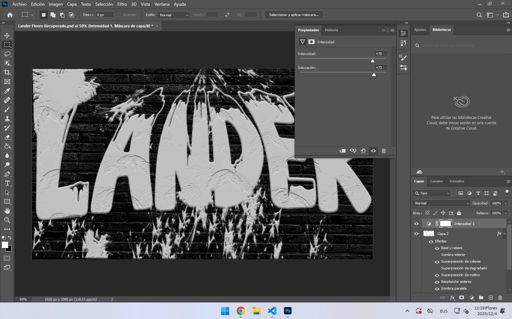
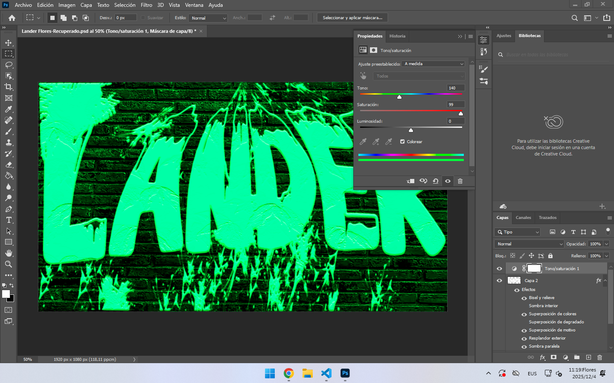

# Photoshop-eko Geruza Funtzioak

- [Photoshop-eko Geruza Funtzioak](#photoshop-eko-geruza-funtzioak)
  - [Zer dira geruzak irudi-edizioan?](#zer-dira-geruzak-irudi-edizioan)
  - [Nola erabiltzen dira Photoshop-en?](#nola-erabiltzen-dira-photoshop-en)
  - [💡 Photoshop-eko Doikuntza Geruzen Funtzioen Gida Azalgarria](#-photoshop-eko-doikuntza-geruzen-funtzioen-gida-azalgarria)
      - [1. Bete-Geruzen Sorkuntza (Fill Layers)](#1-bete-geruzen-sorkuntza-fill-layers)
    - [2. Tonu eta Argitasun Doikuntzak (Tonal Adjustments)](#2-tonu-eta-argitasun-doikuntzak-tonal-adjustments)
    - [3. Kolore Doikuntzak (Color Adjustments)](#3-kolore-doikuntzak-color-adjustments)

## Zer dira geruzak irudi-edizioan?
- #### Geruzak irudi independenteak dira zeintzuk lerrokatzen dira goitik behera irudi oso bat osatzeko. Adibidez, irudi batean fondoa geruza bat izan daiteke.

## Nola erabiltzen dira Photoshop-en?
- ### Irudiaren beheko eskuineko aldean daude hauek geruza aukeratuta daukazunean.

## 💡 Photoshop-eko Doikuntza Geruzen Funtzioen Gida Azalgarria

#### 1. Bete-Geruzen Sorkuntza (Fill Layers)
Aukera hauek geruza bat eduki estatiko batekin betetzeko aukera ematen dute, askotan atzeko planoetarako edo gainjartze-efektuetarako erabiltzen da.

- #### **Kolore uniformea... (Solid Color)**

**Funtzioa:** Geruza bat sortzen du, kolore solido bakar batez osorik betetzen dena.

**Erabilera nagusia:** Koloretako atzeko planoak sortzea, edo irudiari kolore-tonu bat aplikatzea fusio-modu bat erabiliz.

- #### **Gradientea... (Gradient)**

**Funtzioa:** Bi kolore edo gehiagoren arteko pixkanakako trantsizioarekin betetako geruza bat sortzen du.

**Erabilera nagusia:** Argiztapena simulatzea, kolore-binetak sortzea edo trantsizio leuneko atzeko planoak sortzea.

- #### **Motiboa... (Pattern)**

**Funtzioa:** Geruza bat sortzen du, aurrez definitutako edo pertsonalizatutako eredu bat (edo ehundura) errepikatuz betetzen dena.

**Erabilera nagusia:** Ehundura bisualak edo atzeko plano apaingarri errepikakorrak gehitzea.

### 2. Tonu eta Argitasun Doikuntzak (Tonal Adjustments)
Hauek dira zure irudiaren esposizioa, argitasuna eta kontrastea kontrolatzeko funtsezko tresnak.

- #### **Distira/kontrastea... (Brightness/Contrast)**

**Funtzioa:** Argitasuna (argitasun orokorra) eta eremu argi eta ilunen arteko aldea (kontrastea) modu erraz eta globalean doitzen ditu.

**Erabilera nagusia:** Tonu-zuzenketak azkarrak eta orokorrak.

- #### **Mailak... (Levels)**

**Funtzioa:** Irudiaren tonu-tartea kontrolatzen du puntu beltza, puntu zuria eta tonu ertainak mapatuz.

**Erabilera nagusia:** Kontrastea zuzentzea, puntu zuri eta beltz egokia ezartzea eta irudiaren dentsitatea doitzea.

- #### **Kurbak... (Curves)**

**Funtzioa:** Tonu-zuzentzeko tresnarik indartsuena. Itzalen, tonu ertainen eta argiztapenen puntu zehatzak modu independentean kontrolatu eta doitzeko aukera ematen du.

**Erabilera nagusia:** Tonu-zuzenketak oso zehatzak, kontraste-doikuntza aurreratuak eta kolore-manipulazioak kanal bidez.

- #### **Esposizioa... (Exposure)**

**Funtzioa:** Irudia doitzeko aukera ematen du, kamera baten konfigurazioa simulatuz, esposizioa, desplazamendua (offset) eta gamma zuzenketa kontrolatuz.

**Erabilera nagusia:** Nabarmen gutxi-esposatutako edo gehiegi-esposatutako irudiak zuzentzea, RAW edo HDR fitxategietarako baliagarria.

### 3. Kolore Doikuntzak (Color Adjustments)
Tresna hauek kolorearen bizitasunean, ñabarduretan eta intentsitatean jartzen dute arreta.

- #### **Bizitasuna... (Vibrance)**

**Funtzioa:** Koloreen saturazioa modu adimendunean handitzen edo gutxitzen du. Bizitasun kontrolak nagusiki gutxien saturatutako koloreei eragiten die (larruazaleko tonuak babestuz).

**Erabilera nagusia:** Irudiaren bizitasuna handitzea, artifiziala edo gain-saturatua iruditu gabe.

- #### **Tonu/saturazioa... (Hue/Saturation)**

**Funtzioa:** Kolorearen hiru propietateak manipulatzeko aukera ematen du: Tonua (kolorea bera), Saturazioa (purutasuna edo intentsitatea) eta Argitasuna (klaritate).

**Erabilera nagusia:** Objektu zehatzen kolorea aldatzea, eremuak desaturatzea edo irudia zuri-beltzera bihurtzea.

