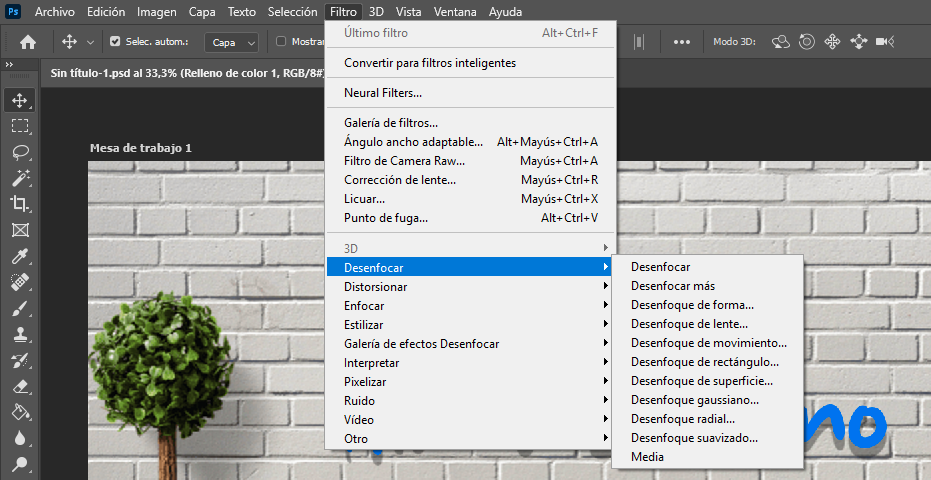

# 📘 Photoshop-eko Filtroa: Desenfokatu atala

Photoshop-en, **Filtro → Desenfocar** atalaren barruan, irudian leuntasuna, mugimendu-sentsazioa edo sakonera sortzeko hainbat efektu daude. Behean menuan agertzen diren aukera bakoitza azaltzen da.

## 🔹 1. Desenfokatu (Desenfocar)
Irudi osoan edo hautapenean modu uniformean aplikatzen den oinarrizko desenfokatu leuna.

## 🔹 2. Gehiago desenfokatu (Desenfocar más)
Oinarrizko desenfokatuaren bertsio indartuagoa; efektua sendoago aplikatzen du.

## 🔹 3. Formaren bidezko desenfokatzea (Desenfoque de forma…)
Aurrez definitutako forma batean oinarritutako desenfokatu pertsonalizatuak sortzen ditu. Efektu artistikoetarako erabilgarria.

## 🔹 4. Lente-desenfokatzea (Desenfoque de lente…)
Kameraren benetako desenfokatze-efektua simulatzen du. Sakonera-eremua, diafragma eta argi-banaketa kontrolatzeko aukera ematen du.

## 🔹 5. Mugimendu-desenfokatzea (Desenfoque de movimiento…)
Objektu bat mugitzen ari dela irudikatzen du. Angelua eta distantzia doitu daitezke.

## 🔹 6. Laukizuzen-desenfokatzea (Desenfoque de rectángulo…)
Laukizuzen eremu baten barruan aplikatzen den desenfokatu norabiduna sortzen du.

## 🔹 7. Gainazal-desenfokatzea (Desenfoque de superficie…)
Azalera lauak desenfokatzen ditu ertzak ondo mantenduz. Azala leuntzeko oso erabilia, xehetasunak ez galtzeko.

## 🔹 8. Gauss-desenfokatzea (Desenfoque gaussiano…)
Oso erabilia. Kurba gaussiar batean oinarritutako leunketa aplikatzen du. Argazki-konponketan eta efektu leunetan oso ohikoa.

## 🔹 9. Desenfokatu erradiala (Desenfoque radial…)
Biraketa edo zoom-mugimendua simulatzen duen desenfokatu zirkularra sortzen du.

## 🔹 10. Desenfokatu leundua (Desenfoque suavizado…)
Ertzak errespetatzen dituen desenfokatu leun eta kontrolatua. Zarataren murrizketarako oso aproposa.

## 🔹 11. Batez bestekoa (Media)
Hautatutako eremuaren koloreak batez bestekatu eta tonu uniforme batekin ordezkatzen ditu. Atzeko planoetarako edo leunketa muturrerako erabilgarria.

