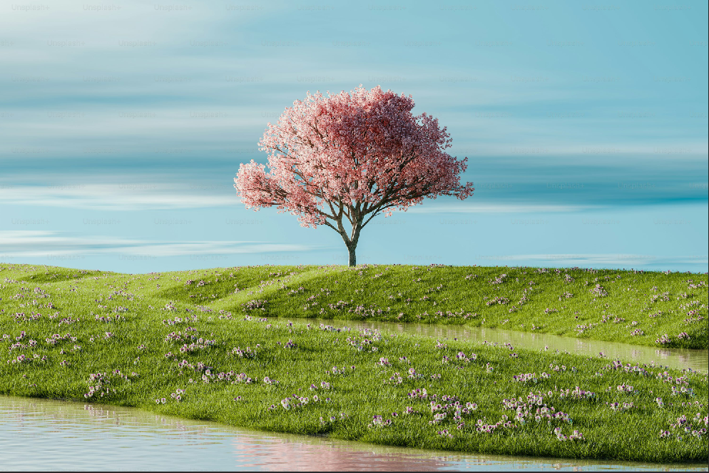
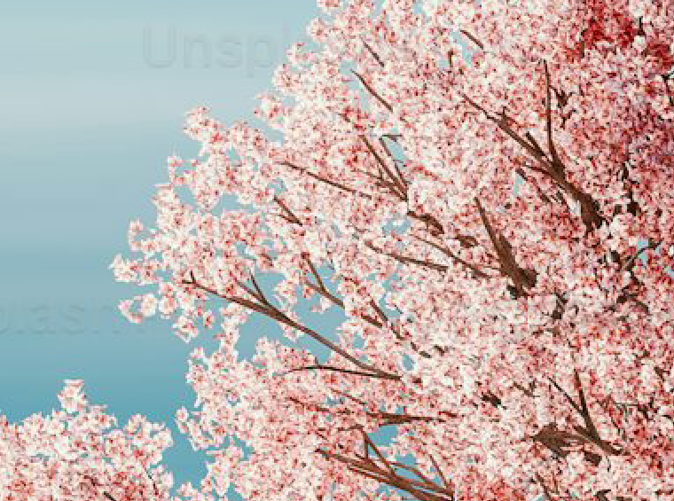
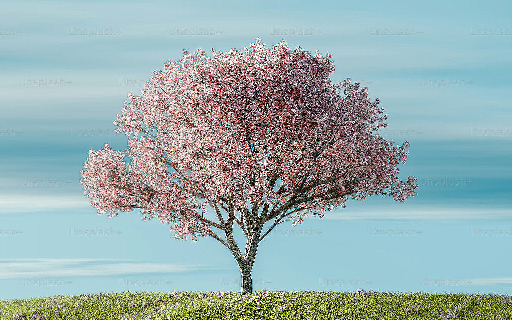
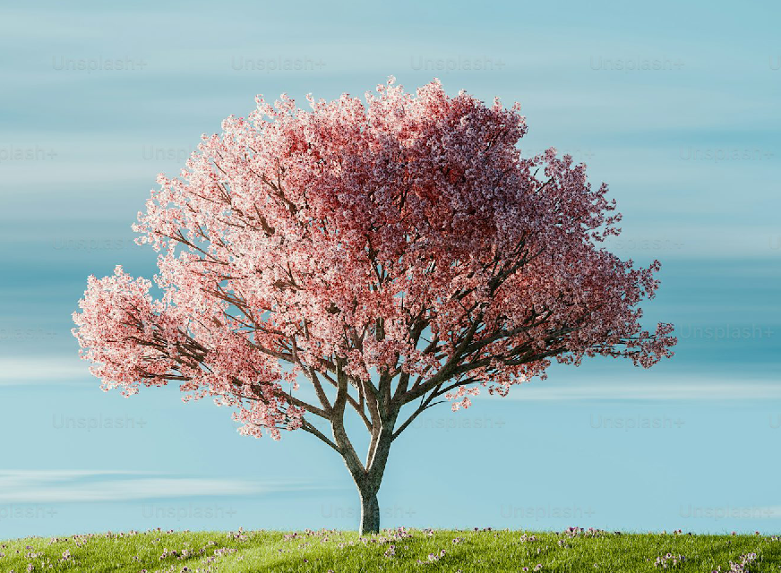
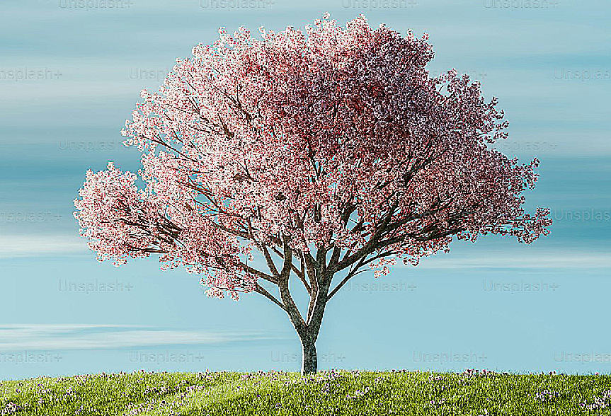
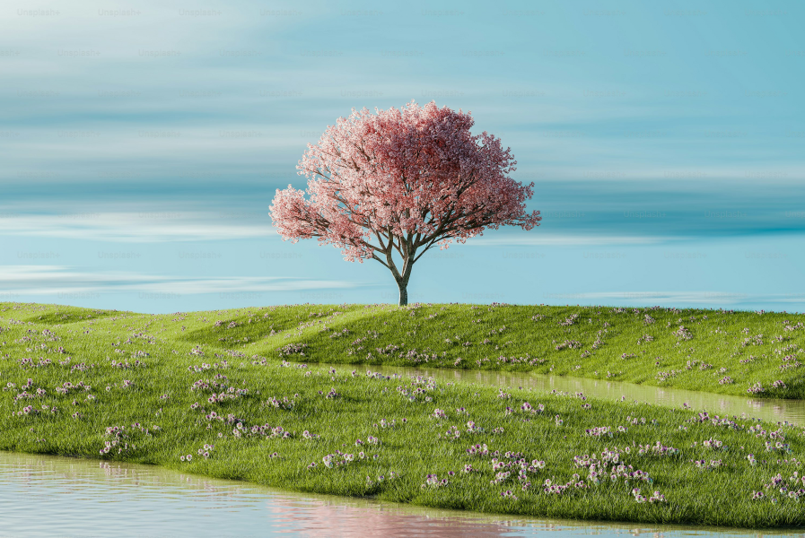
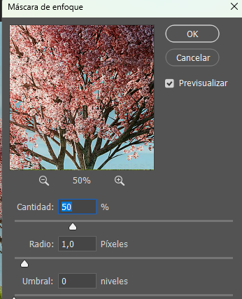

# 1. 🔍 Photoshop-eko **Enfocar / Sharpen** menuaren funtzionamendua

- [1. 🔍 Photoshop-eko **Enfocar / Sharpen** menuaren funtzionamendua](#1--photoshop-eko-enfocar--sharpen-menuaren-funtzionamendua)
  - [1.1. ✅ 1. **Enfocar (Sharpen)**](#11--1-enfocar-sharpen)
  - [1.2. ✅ 2. **Enfocar bordes (Sharpen Edges)**](#12--2-enfocar-bordes-sharpen-edges)
  - [1.3. ✅ 3. **Enfocar más (Sharpen More)**](#13--3-enfocar-más-sharpen-more)
  - [1.4. ✅ 4. **Enfoque suavizado (Smart Sharpen)**](#14--4-enfoque-suavizado-smart-sharpen)
  - [1.5. ✅ 5. **Estabilizador de imagen (Shake Reduction)**](#15--5-estabilizador-de-imagen-shake-reduction)
  - [1.6. ✅ 6. **Máscara de enfoque (Unsharp Mask)**](#16--6-máscara-de-enfoque-unsharp-mask)
- [2. ⭐ Egoeraren arabera zein erabili?](#2--egoeraren-arabera-zein-erabili)

**Enfocar** edo **Sharpen** iragazkiek irudiaren ertzak eta xehetasunak nabarmentzen dituzte, inguruko pixel artean kontrastea handituz.  
Ez dute informazio berririk sortzen: dagoena indartu egiten dute.

---

## 1.1. ✅ 1. **Enfocar (Sharpen)**
Enfokatze oinarrizkoena da.  
Automatikoki enfokatze arin bat aplikatzen du.

**✔ Xehetasun apur bat gehitzeko**, doikuntza konplexurik gabe. 
Irudi originala: 
Adibidiea enfokatzen: 

---

## 1.2. ✅ 2. **Enfocar bordes (Sharpen Edges)** 
Irudiaren **ertzak soilik** enfokatzen ditu, gune leunetan zarata ez gehitzeko.

**✔ Azal leunetan, zeruan edo atzeko planoetan oso erabilgarria.** 

Irudi originala: 
Adibidea ertzak enfokatuta: 

---

## 1.3. ✅ 3. **Enfocar más (Sharpen More)**
“Enfocar” iragazkiaren bertsio indartsuagoa.

**✔ Irudi oso bigunak sendotzeko.**  
⚠ Zarata edo haloak sor ditzake gehiegizko aplikazioan.
Irudi originala: 
Adibidea enfokatu gehiagorekin: 

---

## 1.4. ✅ 4. **Enfoque suavizado (Smart Sharpen)**
Enfokatze-tresnarik profesionalena. Hurrengo kontrolak ditu:
- **Amount (Kopurua)** – indarra  
- **Radius (Erradioa)** – ertzen zabalera  
- **Noise Reduction (Zarata murriztea)**  
- **Lausotze mota** zuzendu daiteke (mugimendua, Gaussian blur, lente-lausoa)
  Konfigurazioaren irudia: 

**✔ Kontrol zehatzena; argazkigintzarako aproposa.**
Irudi originala:
Irudia enfokatu lehundarenekin: 

---

## 1.5. ✅ 5. **Estabilizador de imagen (Shake Reduction)**
**Kamera-mugimenduagatik sortutako lausotzea** zuzentzen du.

Photoshop-ek irudia aztertzen du eta mugimenduaren ibilbidea kalkulatzen du enfokatze efektua sortzeko.

**✔ Oso erabilgarria dardara arineko argazkietan.**

Konfigurazioaren irudia: 
Irudi originala: 
Irudia irudi egonkortzailearekin: 

---

## 1.6. ✅ 6. **Máscara de enfoque (Unsharp Mask)**
Enfokatze metodo klasikoa eta oso ohikoa. Hiru parametro nagusi ditu:
Konfigurazioaren irudia ç
Irudi originala: 
Irudia zorrotz gabeko maskararekin:
- **Amount (Kopurua)**  
- **Radius (Erradioa)**  
- **Threshold (Atalasea)** – zenbat desberdintasun behar den efektua aplikatzeko

**✔ Metodo indartsua eta malgua.**  
**✔ Argazkigintza digitalean oso erabilia.**

---

# 2. ⭐ Egoeraren arabera zein erabili?

| Egoera | Gomendatutako iragazkia |
|--------|--------------------------|
| Azkar enfokatu nahi baduzu | **Enfocar** |
| Zarata saihestu nahi bada | **Enfocar bordes** |
| Irudia oso biguna bada | **Enfocar más** |
| Kontrol zehatza eta profesionala | **Enfoque suavizado** |
| Mugimenduak lausotutako argazkiak | **Estabilizador de imagen** |
| Enfokatze klasiko eta zehatza | **Máscara de enfoque** |

---

