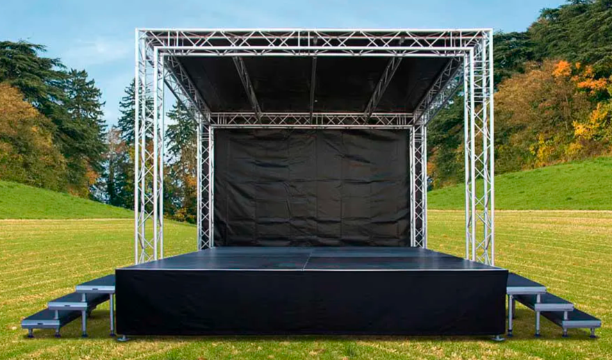
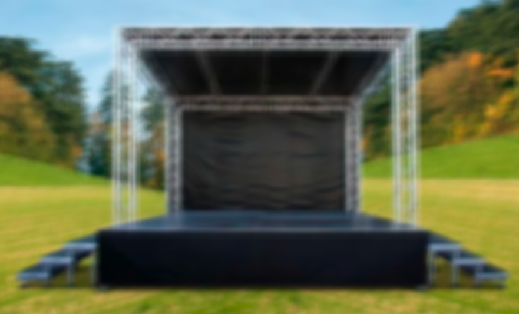
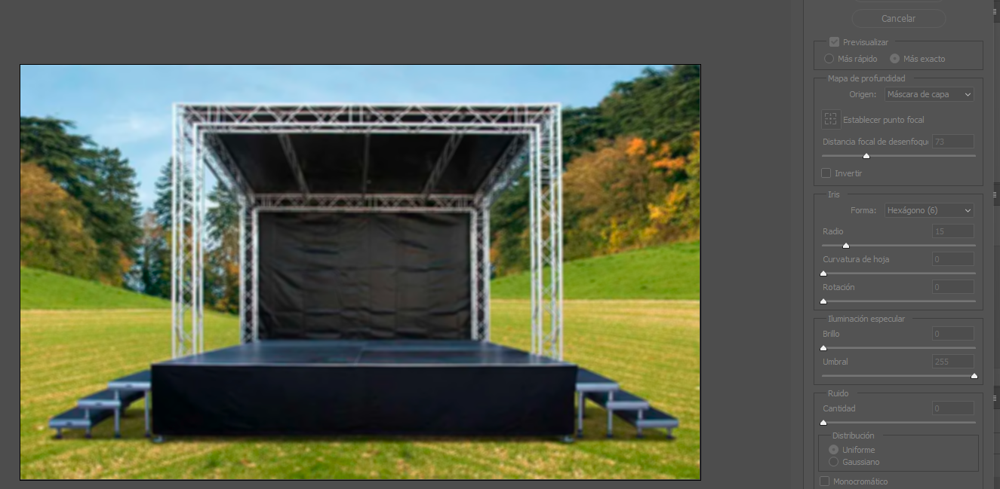
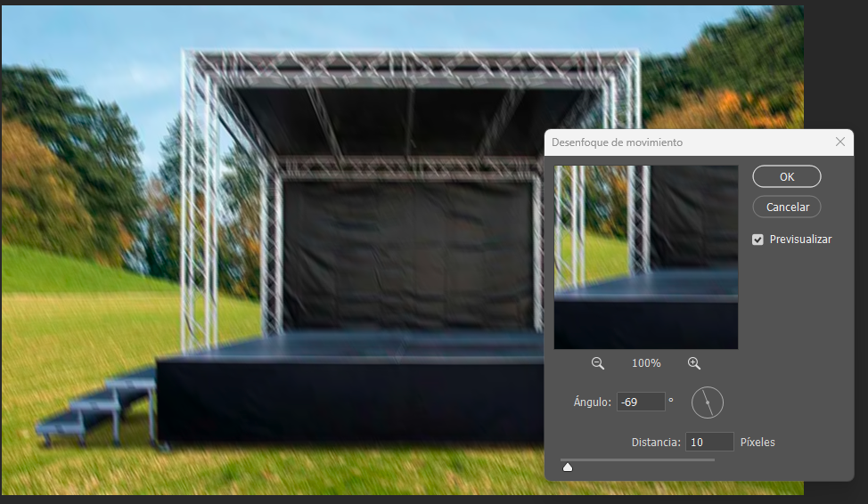
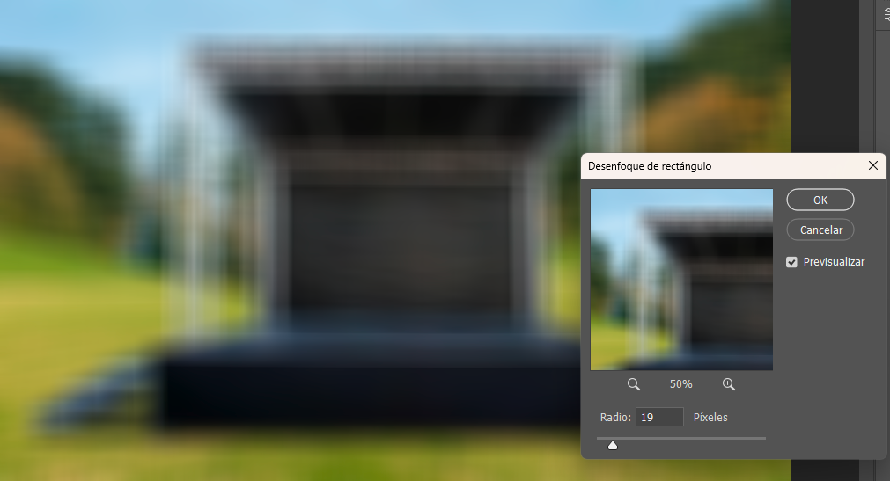
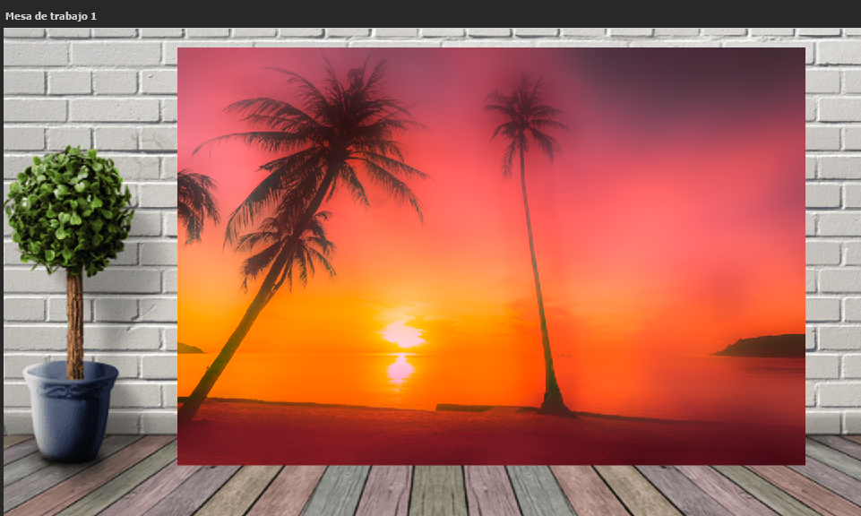
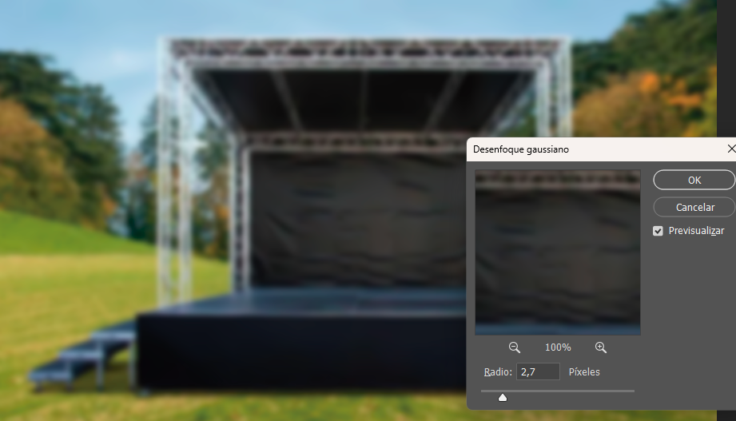
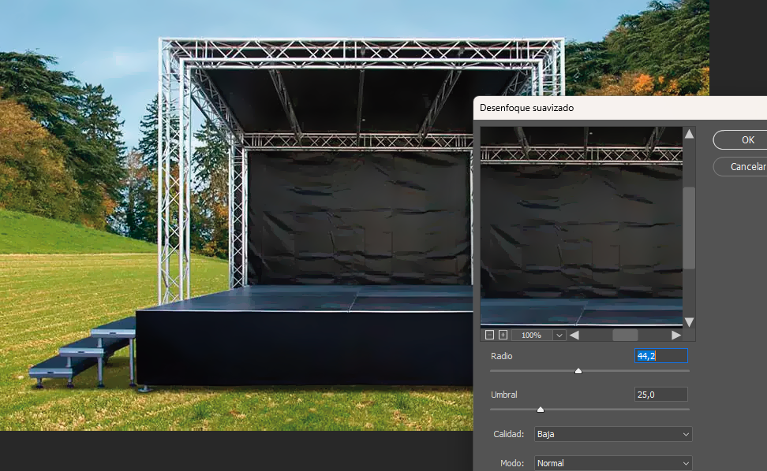

# 📘 Photoshop-eko Filtroa: Desenfokatu atala
### _Photoshop-en desenfokatze-aukerak modu errazean azaltuta_

## 📑 Aurkibidea
- [📘 Photoshop-eko Filtroa: Desenfokatu atala](#-photoshop-eko-filtroa-desenfokatu-atala)
    - [_Photoshop-en desenfokatze-aukerak modu errazean azaltuta_](#photoshop-en-desenfokatze-aukerak-modu-errazean-azaltuta)
  - [📑 Aurkibidea](#-aurkibidea)
  - [🔹 1. Desenfokatu (Desenfocar)](#-1-desenfokatu-desenfocar)
  - [🔹 2. Gehiago desenfokatu (Desenfocar más)](#-2-gehiago-desenfokatu-desenfocar-más)
  - [🔹 3. Formaren bidezko desenfokatzea (Desenfoque de forma…)](#-3-formaren-bidezko-desenfokatzea-desenfoque-de-forma)
  - [🔹 4. Lente-desenfokatzea (Desenfoque de lente…)](#-4-lente-desenfokatzea-desenfoque-de-lente)
  - [🔹 5. Mugimendu-desenfokatzea (Desenfoque de movimiento…)](#-5-mugimendu-desenfokatzea-desenfoque-de-movimiento)
  - [🔹 6. Laukizuzen-desenfokatzea (Desenfoque de rectángulo…)](#-6-laukizuzen-desenfokatzea-desenfoque-de-rectángulo)
  - [🔹 7. Gainazal-desenfokatzea (Desenfoque de superficie…)](#-7-gainazal-desenfokatzea-desenfoque-de-superficie)
  - [🔹 8. Gauss-desenfokatzea (Desenfoque gaussiano…)](#-8-gauss-desenfokatzea-desenfoque-gaussiano)
  - [🔹 9. Desenfokatu erradiala (Desenfoque radial…)](#-9-desenfokatu-erradiala-desenfoque-radial)
  - [🔹 10. Desenfokatu leundua (Desenfoque suavizado…)](#-10-desenfokatu-leundua-desenfoque-suavizado)
  - [🔹 11. Batez bestekoa (Media)](#-11-batez-bestekoa-media)
  - [🔗 Esteka erabilgarria](#-esteka-erabilgarria)

Photoshop-en, **Filtro → Desenfocar** atalaren barruan, irudian leuntasuna, mugimendu-sentsazioa edo sakonera sortzeko hainbat efektu daude. Behean agertzen diren aukera bakoitza azaltzen da.

## 🔹 1. Desenfokatu (Desenfocar)
Irudi osoan edo hautapenean modu uniformean aplikatzen den oinarrizko desenfokatu leuna.

## 🔹 2. Gehiago desenfokatu (Desenfocar más)
Oinarrizko desenfokatuaren bertsio indartuagoa; efektua sendoago aplikatzen du.

## 🔹 3. Formaren bidezko desenfokatzea (Desenfoque de forma…)
Aurrez definitutako forma batean oinarritutako desenfokatu pertsonalizatuak sortzen ditu. Efektu artistikoetarako erabilgarria.

## 🔹 4. Lente-desenfokatzea (Desenfoque de lente…)
Kameraren benetako desenfokatze-efektua simulatzen du. Sakonera-eremua, diafragma eta argi-banaketa kontrolatzeko aukera ematen du.

## 🔹 5. Mugimendu-desenfokatzea (Desenfoque de movimiento…)
Objektu bat mugitzen ari dela irudikatzen du. Angelua eta distantzia doitu daitezke.

## 🔹 6. Laukizuzen-desenfokatzea (Desenfoque de rectángulo…)
Laukizuzen eremu baten barruan aplikatzen den desenfokatu norabiduna sortzen du.

## 🔹 7. Gainazal-desenfokatzea (Desenfoque de superficie…)
Azalera lauak desenfokatzen ditu ertzak ondo mantenduz. Azala leuntzeko oso erabilia, xehetasunak ez galtzeko.

## 🔹 8. Gauss-desenfokatzea (Desenfoque gaussiano…)
Oso erabilia. Kurba gaussiar batean oinarritutako leunketa aplikatzen du. Argazki-konponketan eta efektu leunetan oso ohikoa.

## 🔹 9. Desenfokatu erradiala (Desenfoque radial…)
Biraketa edo zoom-mugimendua simulatzen duen desenfokatu zirkularra sortzen du.

## 🔹 10. Desenfokatu leundua (Desenfoque suavizado…)
Ertzak errespetatzen dituen desenfokatu leun eta kontrolatua. Zarataren murrizketarako oso aproposa.

## 🔹 11. Batez bestekoa (Media)
Hautatutako eremuaren koloreak batez bestekatu eta tonu uniforme batekin ordezkatzen ditu. Atzeko planoetarako edo leunketa muturrerako erabilgarria.

## 🔗 Esteka erabilgarria
[Link](https://helpx.adobe.com/es/photoshop/using/quick-actions/blur-background.html)