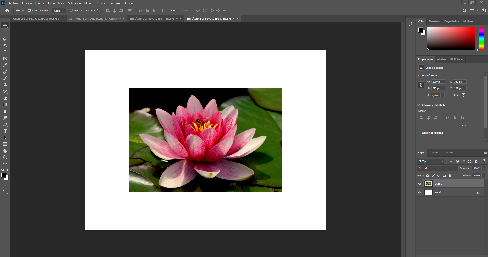
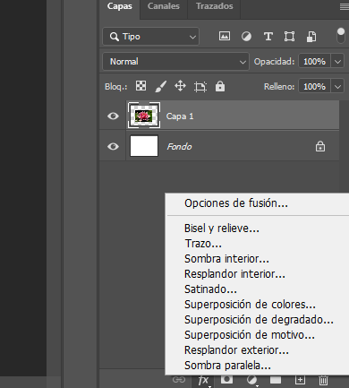
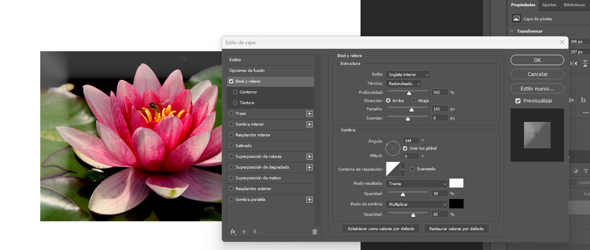
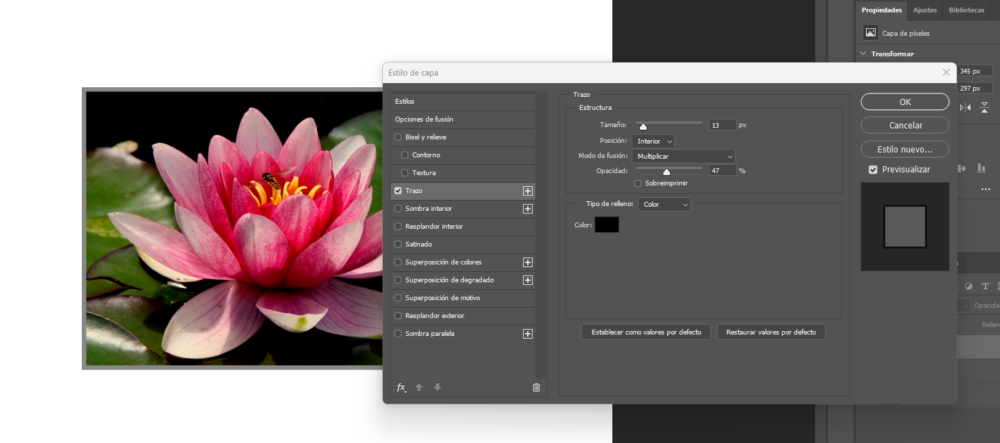
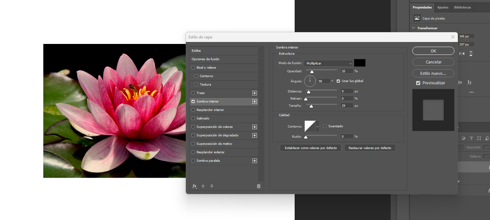
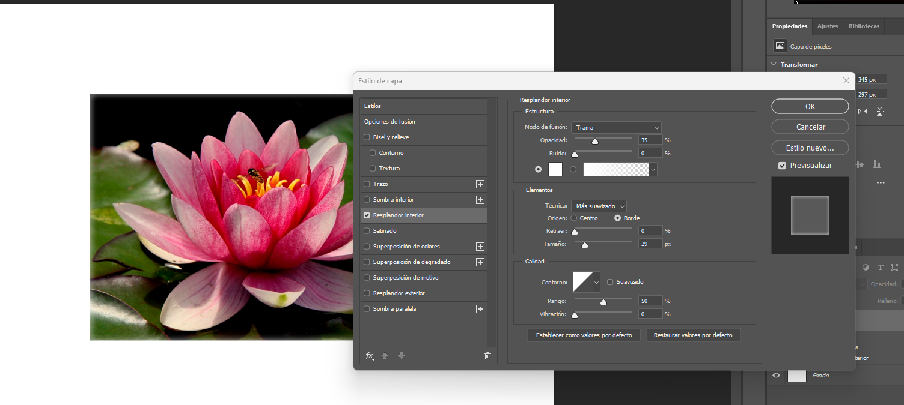
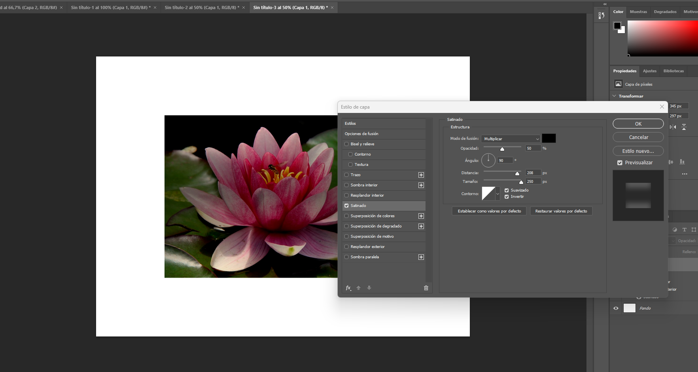

#  GERUZA - PHOTOSHOP

## AURKIBIDEA:
- [GERUZA - PHOTOSHOP](#geruza---photoshop)
  - [AURKIBIDEA:](#aurkibidea)
        - [- Lehenik argazki bat aukeratu genuen, nahi genuena.](#--lehenik-argazki-bat-aukeratu-genuen-nahi-genuena)
        - [- Adibidez, nik aukeratu lore hau.](#--adibidez-nik-aukeratu-lore-hau)
        - [- Gero argazki hori Photoshopen itsasten duzu (Crl + V) eta horrela geratu beharko litzateke](#--gero-argazki-hori-photoshopen-itsasten-duzu-crl--v-eta-horrela-geratu-beharko-litzateke)
        - [- Gero, app-aren (Fx) zati honetara etorriko zara, eta aukera hauen artean hauta dezakezu, aukera hauen artean hauta dezakezu:](#--gero-app-aren-fx-zati-honetara-etorriko-zara-eta-aukera-hauen-artean-hauta-dezakezu-aukera-hauen-artean-hauta-dezakezu)
        - [- Orain azalduko dut eta ikusiko dugu nola funtzionatzen duen bakoitzak.](#--orain-azalduko-dut-eta-ikusiko-dugu-nola-funtzionatzen-duen-bakoitzak)
        - [1- Bisel y Relieve](#1--bisel-y-relieve)
        - [2- Trazo](#2--trazo)
        - [3- Sombra interior](#3--sombra-interior)
        - [4- Resplandor interior](#4--resplandor-interior)
        - [5- Satinado](#5--satinado)

##### - Lehenik argazki bat aukeratu genuen, nahi genuena.

##### - Adibidez, nik aukeratu lore hau.

##### - Gero argazki hori Photoshopen itsasten duzu (Crl + V) eta horrela geratu beharko litzateke
 

##### - Gero, app-aren (Fx) zati honetara etorriko zara, eta aukera hauen artean hauta dezakezu, aukera hauen artean hauta dezakezu:

- Bisel y relieve
- Trazo
- Sombra interior
- Resplandor interior
- Satinado

##### - Orain azalduko dut eta ikusiko dugu nola funtzionatzen duen bakoitzak.

##### 1- Bisel y Relieve

- Fusio-modua: Itzal satinatuaren efektuak geruzaren azpiko pixelekin nola elkarreragiten duen kontrolatzen du. Agertzen den balio lehenetsia "Biderkatu" da
- Opakutasuna: Satinatuaren itzalaren gardentasuna zehazten du. % 64ko balioak (irudian ikusten den bezala) itzala partzialki gardena dela esan nahi du.
- Angelua: Efektuaren argia edo itzala zein norabidetatik "datorren" zehazten du. Erakutsitako balioa 90º-koa da.
- Distantzia: Satinatuaren itzala objektuaren ertzetik hedatzen den distantzia egokitzen du. Erakutsitako balioa 208 px da.
- Tamaina: Satinatuaren itzalaren tamaina (edo desenfokatze-erradioa) kontrolatzen du. Erakutsitako balioa 250 px da.

##### 2- Trazo

- Tamaina: Ertzaren lodiera kontrolatzen du. Erakutsitako balioa 13 px da.
- Posizioa: Marra objektuaren ingeradaren barnealdean, kanpoaldean edo erdian jartzen den zehazten du. Irudian "Barrualdea" hautatu da.
- Galdatzeko modua: Zehaztu nola nahasten diren trazuaren kolorea eta azpiko geruzen koloreak. Agertzen den balioa "Biderkatu" da.
- Opakutasuna: trazuaren gardentasuna doitzen du. Erakutsitako balioa % 47 da.
- Gaininprimaketa: inprimaketa profesionalarekin lotutako aukera aurreratua, koloreak inprimatzean nola gainjartzen diren eragiten duena

##### 3- Sombra interior 

- Fusio modua: Itzalak geruzaren edukiarekin nola interaktuatzen duen kontrolatzen du. Agertzen den balioa "Biderkatu" da.
- Opakutasuna: Itzalaren gardentasuna doitzen du. Erakusten den balioa %20 da.
- Angelu eta Erabili argi globala: Argiaren norabidea definitzen du. Angeluaren balioa 90° da. "Erabili argi globala" laukitxoak irudiko beste itzal edo bisel batzuekin angelua sinkronizatzeko aukera ematen du.
- Distantzia: Itzala objektuaren ertzetatik zenbat urrun hedatzen den kontrolatzen du. Erakusten den balioa 5 px da.
- Atzera egin: Itzalaren "spread" edo hedapenaren antzekoa da, bere oinarriaren sendotasuna kontrolatuz. Erakusten den balioa %0 da.
- Tamaina: Itzalaren tamaina (edo lausotze-erradioa) doitzen du, ertzak leunduz. Erakusten den balioa 29 px da.

##### 4- Resplandor interior 

- Egitura: Fusio modua "Trama" da %35eko opakutasunarekin, eta kolore zuriko distira sortzen du.
- Elementuak: Distira objektuaren zentrotik ateratzen da, teknika "Más suavizado" erabiliz eta 29 px-ko tamaina du.
- Kalitatea: Ingerua estandarra da eta ez du zaratari edo bibraziorik gehitzen.
  
##### 5- Satinado

- Egitura: Fusio modua "Biderkatu" da %50eko opakutasunarekin.
- Sakonera: Itzala 90°-ko angeluan aplikatzen da, 208 px-ko distantzia eta 292 px-ko tamainarekin.
- Kalitatea: Ingerua lehenetsia da eta ez da alderantzikatzen.

