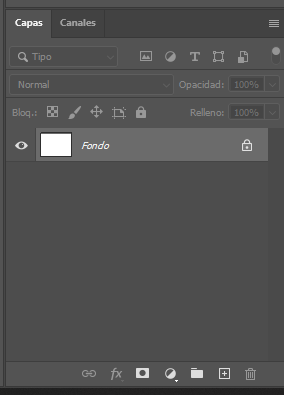
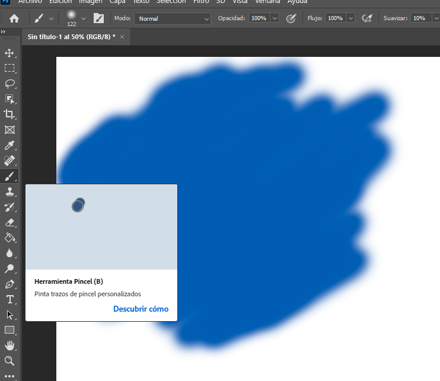

## 🎨 Geruzak eta Nahasketa Moduak (Oinarriak)

---

**Geruza bat** irudi bateko **txantiloi garden** bat bezalakoa da. Photoshop-eko irudiak geruza horien pilaketa bat dira.

* **Geruzak:** Irudiaren **zati bat** aldatzeko balio dute, beste zatiak ukitu gabe.
* **Nahasketa Moduak:** **Goiko geruzako** eta **beheko geruzako** koloreak **nola konbinatzen** diren zehazten duten arauak dira.

---

## 🎚️ Nahasketa Modu Motak (Adibideak)

### 1. Kontraste Taldea 💥

| Nahasketa Modua | Zer egiten du (Labur) | Eragin Nagusia |
| :--- | :--- | :--- |
| **Gainjarri (Overlay)** | Argiak argitu eta itzalak ilundu. | **Kontrastea** eta saturazioa asko handitu. |
| **Argi Leuna (Soft Light)** | Gainjarri bezalakoa, baina **askoz leunagoa**. | Argi eta itzal hobekuntza txikiak. |
| **Nahasketa Gogorra (Hard Mix)** | Irudia **8 kolore oinarrizkora** murriztu. | Komiki edo **kolore lauko** itxura eman. |

### 2. Alde Taldea 🔄

| Nahasketa Modua | Zer egiten du (Labur) | Eragin Nagusia |
| :--- | :--- | :--- |
| **Aldea (Difference)** | Argitasun balioak elkarri kendu. | **Koloreak inbertitu**. Beltzak ez du ezer aldatzen. |
| **Bazterketa (Exclusion)** | Aldea bezalakoa, baina **leuntxoagoa**. | Kontraste txikiagoko kolore inbertsioa. |

---

### 💡 Geruzak Kontrolatzeko Gakoak

1.  **Opakutasuna (Opacity):** Geruza zein **garden** den.
2.  **Betegarria (Fill):** Opakutasunaren antzekoa.
3.  **Nahasketa Modua (Blending Mode):** Koloreak konbinatzeko **matematika araua**.

---
