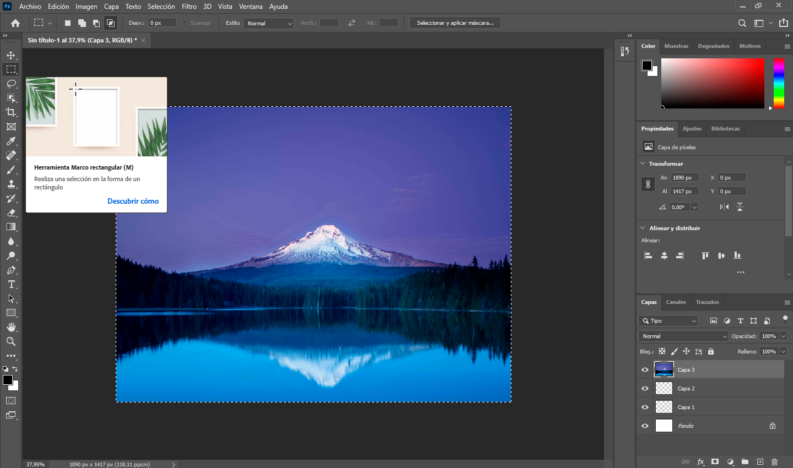
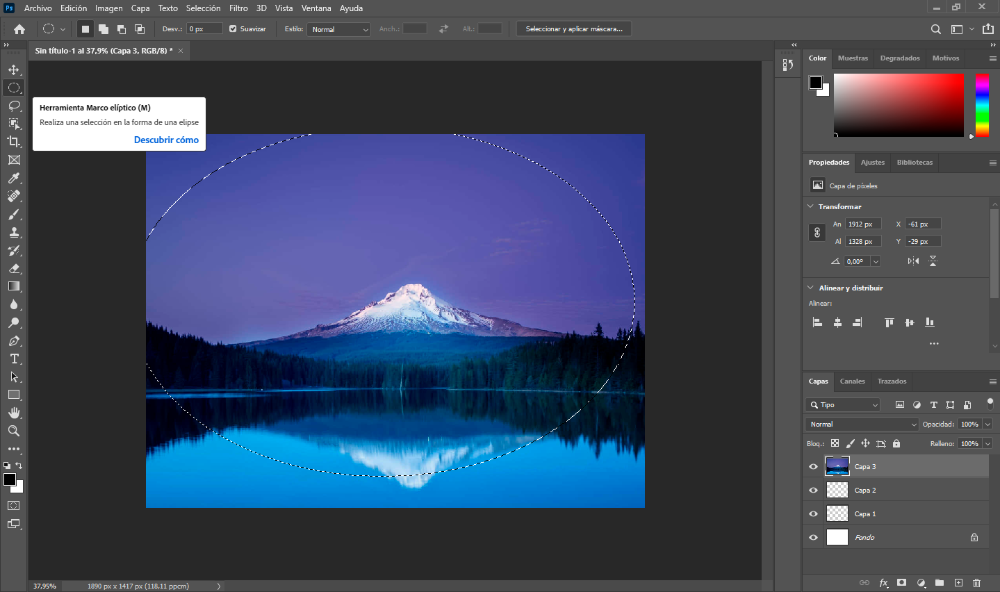
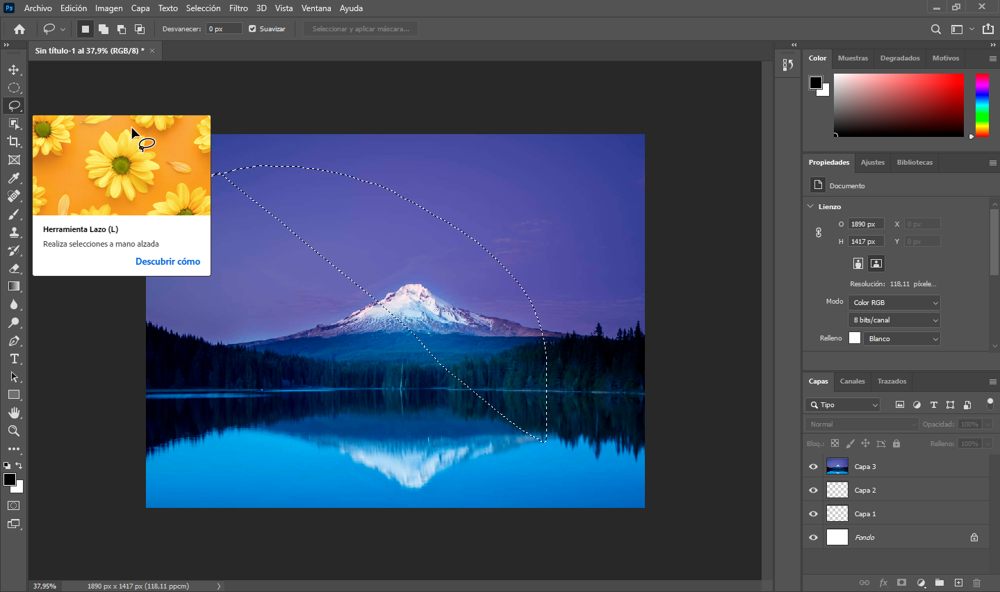
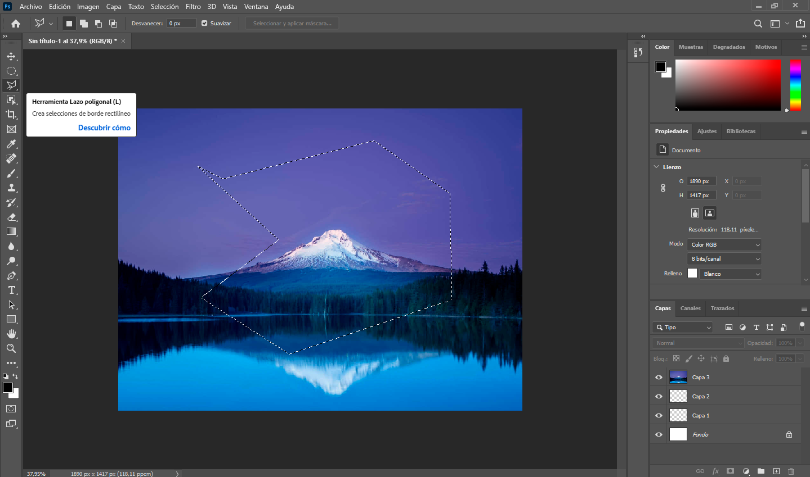
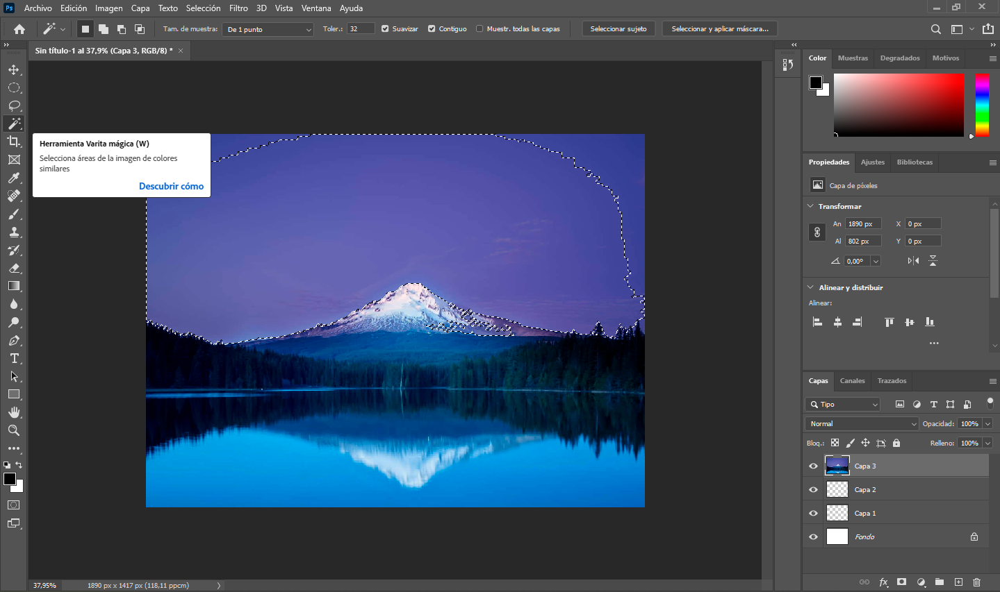
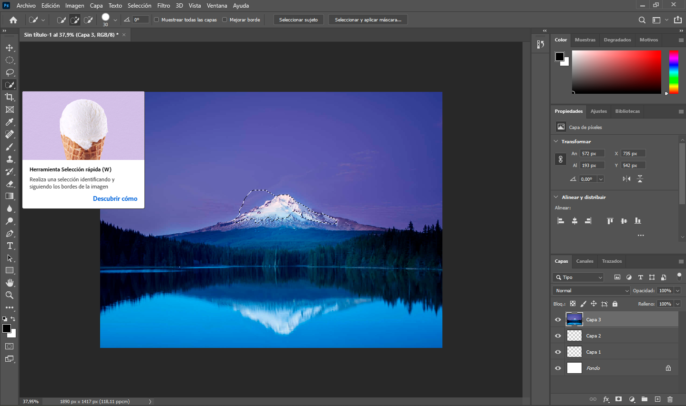
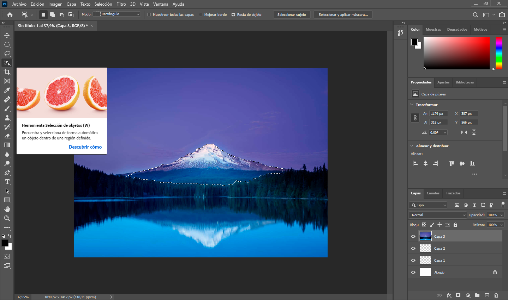
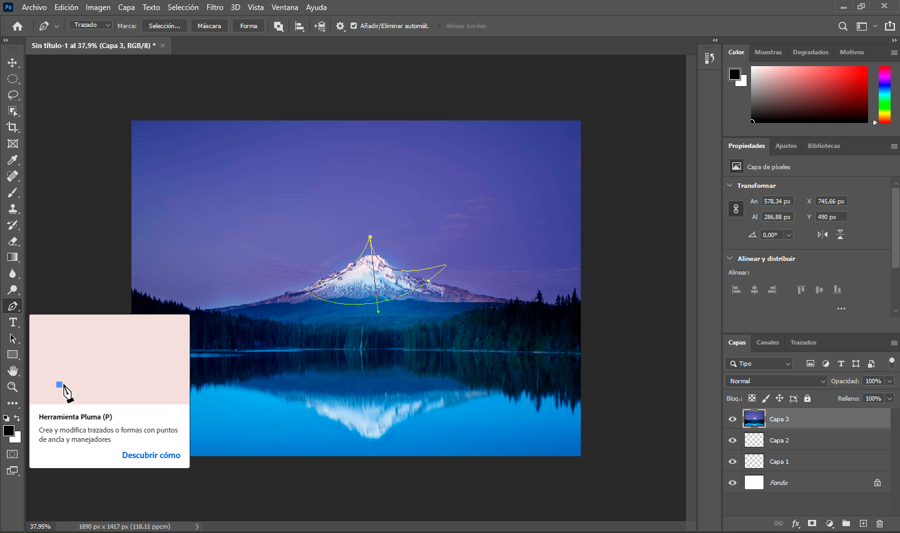

# Photoshop
## Aukeraketa motak:
Enaitz

- [Photoshop](#photoshop)
  - [Aukeraketa motak:](#aukeraketa-motak)
  - [Zer da?](#zer-da)
  - [Herramientas Geométricas (Marquee Tools):](#herramientas-geométricas-marquee-tools)
    - [- Marko angeluzuzena:](#--marko-angeluzuzena)
    - [- Marko eliptikoa:](#--marko-eliptikoa)
  - [Eskuko tresnak/Modu librean (Lasso Tools):](#eskuko-tresnakmodu-librean-lasso-tools)
    - [- Zinta (Normala)](#--zinta-normala)
    - [- Lazo (Poligonala)](#--lazo-poligonala)
    - [- Lazo (Magnetikoa)](#--lazo-magnetikoa)
  - [Tresna automatikoak eta adimendunak (Automated Tools):](#tresna-automatikoak-eta-adimendunak-automated-tools)
    - [- Magic Wand](#--magic-wand)
    - [- Hautaketa azkarra](#--hautaketa-azkarra)
    - [- Object Selection Tool / Select Subject](#--object-selection-tool--select-subject)
  - [Tresna aurreratuak/bektorialak:](#tresna-aurreratuakbektorialak)
    - [- Luma](#--luma)
  

## Zer da?
Hautaketa bat irudi baten eremu isolatu bat da. Helburua da aldaketak aplikatzea (hala nola kolore-doikuntzak, iragazkiak edo ebakinak) zehaztutako eremu horretan soilik, eta gainerako irudiak edozein aldaketatatik babestea. Hautatutako eremua begiz identifikatzen da lerro eten bizidun baten bidez (normalean "inurri ibiltariak" deitzen zaio).

## Herramientas Geométricas (Marquee Tools):
### - Marko angeluzuzena:
- Aukeraketa karratu edo angeluzuzen perfektuak.

### - Marko eliptikoa:
- Hautaketa zirkular edo obalatuak.

## Eskuko tresnak/Modu librean (Lasso Tools):
### - Zinta (Normala)
- Esku hutsezko marrazkia. Pultsu ona behar da.

### - Lazo (Poligonala)
- Ertz zuzen eta angeluarrak dituzten aukeraketak, klik bidez.

### - Lazo (Magnetikoa)
- Objektuen ertzetara "atxikitzen" da automatikoki kolore-kontrastean oinarrituta.

## Tresna automatikoak eta adimendunak (Automated Tools):
### - Magic Wand
- Aukeratu pixelak antzeko koloreekin edo kolore berdinekin tolerantzia-atalase baten barruan.

### - Hautaketa azkarra
- Pintzel motako tresna, automatikoki hazten dena eta ertzak jarraitzen dituena.

### - Object Selection Tool / Select Subject
- Adimen artifizialean oinarritutako tresnak, klik bakar batekin irudiaren objektu edo subjektu nagusiak identifikatu eta.

## Tresna aurreratuak/bektorialak:
### - Luma
- Trazadura bektorial zehatzak sortzea, gero hautapen bihurtzen direnak.
