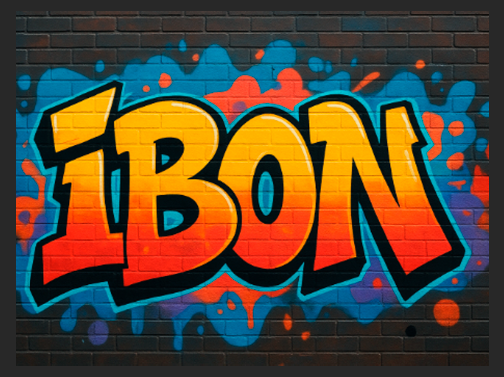
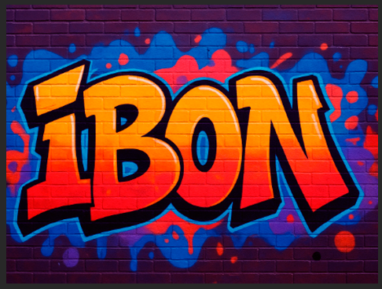
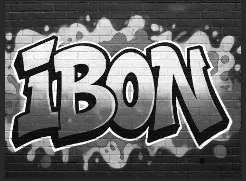
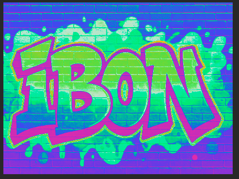

<b><h2>🎨 Photoshop-eko Kolore-Doikuntzen Iragazkiak </h2></b>

Iragazki hauek irudi baten tonalitatea, kolorea eta kontrastea aldatzeko funtsezko tresnak dira.

Hau da gure irudia filtro aplikatu barik:

<b><h1>1. Kolore-Balantza (Equilibrio de Color) </h1></b>

Kolore-Balantza funtsezko tresna da kolorea zuzentzeko edo irudi bati ñabardura artistikoa aplikatzeko.

<h2><b>🔍 Zer egiten du?</b></h2>

Irudi baten kolore-balantzea doitzea ahalbidetzen du, kolore primarioak (Ziana, Magenta, Horia) bere kolore osagarrietara (Gorria, Berdea, Urdina) mugituz.

<h2><b>🔧 Kontrol nagusiak</b></h2>

<b>Lerragailuak:</b> Koloreen nahasketa kontrolatzeko hiru ardatz dituzu:

<b>Ziana ↔ Gorria

Magenta ↔ Berdea

Horia ↔ Urdina </b>

<b>Tonalitateak (Tonos):</b> Doikuntzak hiru tarte tonaletan aplikatu daitezke:

<b>Itzalak (Sombras): </b>Irudiaren zati ilunak

<b>Erdi-Tonuak (Medios Tonos): </b>Distira maila ertaina

<b>Argiuneak (Iluminaciones):</b> Irudiaren zati argienak

<b><h2>🎯 Erabilera ohikoa</h2></b>

Kolore-dominanteak kentzeko (adibidez, irudi urdin edo berdeegia).

Aldarte-efektuak sortzeko (adibidez, egunsenti bati tonu laranja beroa ematea).

Honela ikusten da filtroa aplikatuz:

 

<b><h1>2. Zuri-Beltza (Blanco y Negro)</h1></b>

Zuri-Beltza doikuntza, Photoshop-en, irudi bat gris-eskalara bihurtzeko modu aurreratu eta kontrolatuena da.

<b><h2>🔍 Zer egiten du?</h2></b>

Irudia gris tonu ezberdinetan bihurtzen du, eta desaspertze sinpleak ez bezala, kolore bakoitzaren gris-balioa zehatz kontrolatzeko aukera ematen du.

<b><h2>🔧 Kontrol nagusiak </h2></b>

<b>Kolore-lerragailuak:</b>
Gorria, Horia, Berdea, Ziana, Urdina eta Magenta.
Lerragailu bakoitza mugitzean, jatorrizko kolore horren pixelak argiago edo ilunago bihurtzen dira zuri-beltzean.

<b>Tintea (Tinte):</b>
Zuri-beltzeko irudiari tinte monokromatiko bat gehitzen dio (adibidez, sepia efektua).

<b><h2>🎯 Erabilera ohikoa: </h2></b>

Kontraste dramatikoa sortzeko.

Zuri-beltzeko irudiaren tonalitatearen kontrol osoa izateko.

Honela ikusten da filtroa aplikatu ondoren:

<b><h1>3. Gradiente-Mapa (Mapa de Degradado)</b></h1>

Tresna sortzaile eta doikuntza tonala da, irudiaren distira-tonuak gradiente bateko koloreekin ordezkatzen dituena.

<b><h2>🔍 Zer egiten du? </h2></b>

<b>Irudiaren distira-balioei kolore-gradiente bat esleitzen die:
</b>    <b>
Ezkerreko kolorea → Itzaletan

Tarteko koloreak → Erdi-tonuetan

Eskuineko kolorea → Argiunetan
</b>
<b><h2>🧠 Funtzionamendua </h2></b>

<b>Itzalak:</b> Gradientearen ezkerreko kolorea

<b>Erdi-Tonuak:</b> Tarteko koloreak

<b>Argiuneak:</b> Gradientearen eskuineko kolorea

<b><h2>🎯 Erabilera ohikoa </h2></b>

<b>Bi-tonu / Tonalizazio sortzailea:</b>  Diseinu eta kartel artistikoetan oso erabilia.

<b>Kontraste-zuzenketa:  </b>Tonu ilun eta argiak hobeto definitzeko.

<b>Tonalitate-mapeoa:</b>  Zuri-beltzeko irudietan kolore-paleta artistikoak aplikatzeko.

Honela ikusten da filtroa aplikatu ondoren:

<b>Amaitzeko filtro denak aplikatuz ondoren diseinu desberdinak atera ahal dugu, adibidez filtro guztiak aplikatu ondoren honela gelditzen da irudia:</b>
