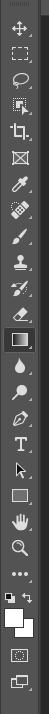
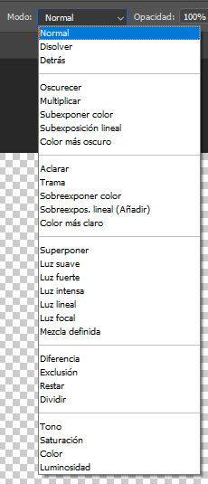

# Erabilpen Gida: Photoshop-eko Degradatu Tresna (Gradient Tool)

Photoshop-eko **degradatu** tresnak hainbat koloreen edo kolore eta gardentasunaren arteko fusio graduala sortzea ahalbidetzen du. Funtsezkoa da atzealde leunetarako, argiztapen efektuetarako eta irudiak sotilki nahasteko.

Degradatu tresna Photoshop-eko **tresna-barran** aurki dezakezu, kolore-trantsizio bat erakusten duen ikono karratu batek irudikatuta. Askotan Margo-pote tresnarekin taldekatzen da; eduki sakatuta ikonoa hautatzeko (bidali duzun 5. irudian ikusten den bezala, tresnak taldekatuta dauden tokian).

## 1. Tresnaren Oinarrizko Erabilera (G)

Metodo zuzenena degradatua mihisean zuzenean "margotzea" da.
### Urratsak:

1.  **Hautatu Tresna:** Egin klik **Degradatua** ikonoan tresna-barran edo erabili `G` tekla lasterra.

    

2.  **Aukeratu Koloreak/Doikuntzak:** Goiko aukera-barran, honako hauek egin ditzakezu:
    *   Klik egin degradatuaren **kolore-laginean** **Degradatu Editorea** irekitzeko eta koloreak, opakutasuna eta kolore-geldialdiak (color stops) pertsonalizatzeko.
    *   Hautatu **degradatu mota** (Lineala, Radiala, Angelua, Ispilatua edo Diamantea).
    *   Doitu **Nahasketa Modua** (Blend Mode) eta **Opakutasun** orokorra.
    *   Markatu **"Alderantzikatu" (Reverse)** degradatuaren norabidea inbertitzeko.
    

3.  **Aplikatu Degradatua:** Egin klik eta arrastatu kurtsorea zure irudiaren gainean. Arrastatzearen luzerak eta norabideak kolore-trantsizioaren hasiera, amaiera eta leuntasuna definitzen dituzte.

    

***Ohar Garrantzitsua:** Edizio ez-suntsitzaile baterako, hobe da degradatua **geruza huts berri batean** aplikatzea.*

## 2. Erabilera Aurreratua: Degradatu Doikuntza Geruzak

Hau da profesionalek gehien erabiltzen duten metodoa, degradatua edonoiz editatzeko aukera ematen baitu, jatorrizko irudiaren pixelak kaltetu gabe.

### Urratsak:

1.  **Gehitu Doikuntza Geruza:** **Geruzak** (Layers) panelean, egin klik "Sortu betegarri edo doikuntza geruza berria" ikonoan (zirkulu erdi bat).
2.  **Hautatu "Degradatua":** Aukeratu **"Degradatua"** aukera goitibeherako menuan.
3.  **Konfiguratu:** Elkarrizketa-leiho bat irekiko da. Hemen honako hauek egin ditzakezu:
    *   Aukeratu **Estilo** bat (Radiala edo Lineala adibidez).
    *   Doitu **Angelu** eta **Eskala**.
    *   Egin klik degradatu-barran **Degradatu Editorea** irekitzeko eta pertsonalizatzeko.

    
4.  **Pantailako Edizioa:** Aurreko metodoarekin ez bezala, honek graduatzailearen zentroa zuzenean irudiaren gainean mugitzeko aukera ematen dizu kurtsorearekin, aplikatu ondoren.

     
## Ohiko Erabilerak eta Aholkuak

*   **Atzealdeak:** Sortu kolore-trantsizio leunak atzealde abstraktuetarako.
*   **Argiztapen Efektuak:** Gehitu argi eta itzal efektu ez-suntsitzaileak.
*   **Irudi Nahasketa:** Erabili degradatu garden bat geruza-maskara batean bi argazki ezin hobeto nahasteko.
*   **Kolore Zuzenketa:** Erabili **Mapa Degradatuaren Doikuntza Geruzak (Gradient Map Adjustment Layers)** irudi oso bat tindatzeko, zuri-beltzeko argazkietarako edo efektu artistikoetarako aproposa.