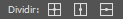
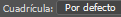
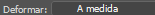
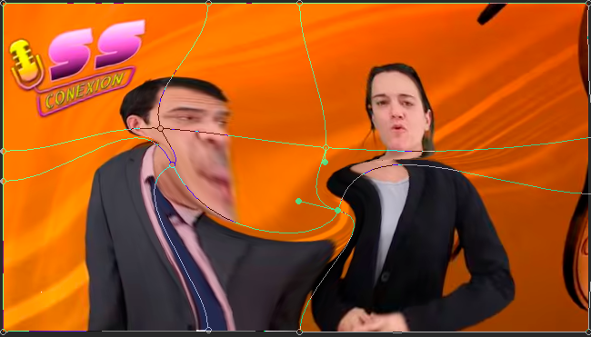

- [Transformazio tresna](#transformazio-tresna)
  - [1. Zatitu (Dividir):](#1-zatitu-dividir)
  - [2. Sareta (Cuadrícula):](#2-sareta-cuadrícula)
  - [3. Deformatu (Deformar):](#3-deformatu-deformar)
- [Beste Elementu Batzuk](#beste-elementu-batzuk)
  - [6. Kurtsorea 0.0 (Cursor 0.0):](#6-kurtsorea-00-cursor-00)
  - [7. Azken ikonoak (Ados/Utzi):](#7-azken-ikonoak-adosutzi)
  - [8. Marra diagonala (ezeztapen-ikurra)](#8-marra-diagonala-ezeztapen-ikurra)
#   Transformazio tresna

## 1. Zatitu (Dividir):
 Aukera honek kontrol-puntu edo zatiketa berriak (lerroak) gehitzeko aukera ematen du deformazio-sarean. Irudiaren gainean eskuin-klik eginez Deformatu moduan, sareta horizontalki, bertikalki edo zeharka zatitzea aukera dezakezu, eta horrek malgutasun eta kontrol handiagoa ematen du deformazioaren eremu zehatzetan.

## 2. Sareta (Cuadrícula):
Goitibeherako menu honek kontrol-sarearen ikusgarritasuna eta xehetasuna kontrolatzen ditu.

## 3. Deformatu (Deformar):
Goitibeherako menu honen bidez, aurrez ezarritako deformazio-estilo bat (Arku, Bandera, etab. bezalakoak) hautatu edo deformazioa pertsonalizatu daiteke.

# Beste Elementu Batzuk

## 6. Kurtsorea 0.0 (Cursor 0.0):
 Seguruenik, kurtsorearen uneko posizioa edo doikuntza espezifiko baten balioa gradu edo pixeletan adierazten du.

## 7. Azken ikonoak (Ados/Utzi):
Ados (egiaztapen-marka) egindako eraldaketa edo deformazioa aplikatzeko edo baieztatzeko erabiltzen da.

## 8. Marra diagonala (ezeztapen-ikurra)
eraldaketa-eragiketa bertan behera uzteko eta aurreko egoerara itzultzeko erabiltzen da, aldaketarik aplikatu gabe.

