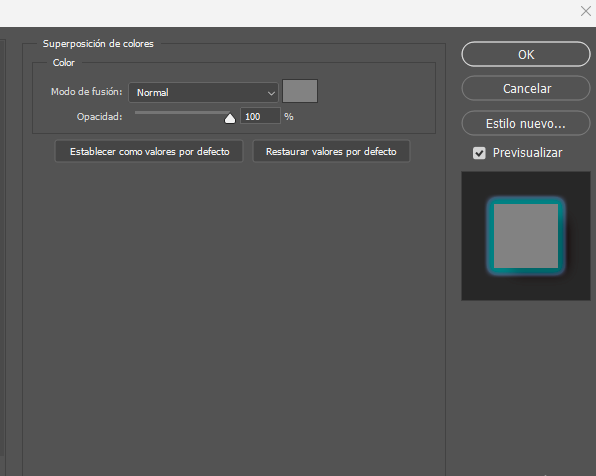
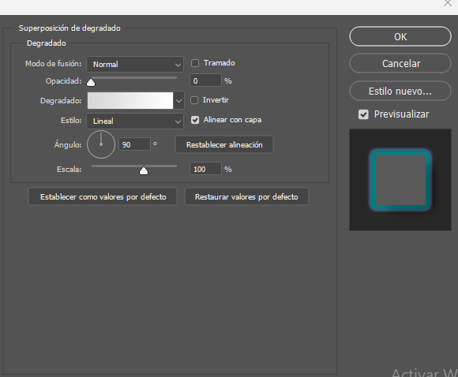
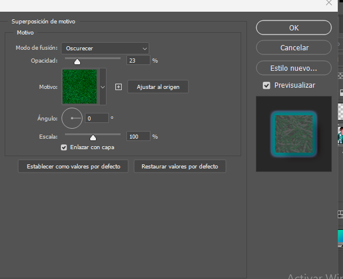
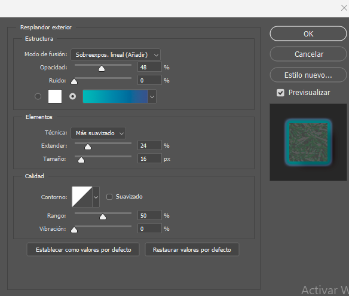
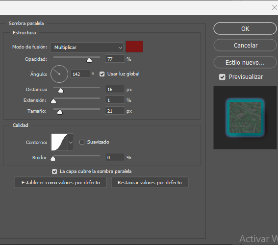

# - [✨ Geruza Mota Bakoitzaren Funtzioa](#-geruza-mota-bakoitzaren-funtzioa)
- [- ✨ Geruza Mota Bakoitzaren Funtzioa](#---geruza-mota-bakoitzaren-funtzioa)
  - [1. Superposición de colores (Kolore Estaldura / Color Overlay)](#1-superposición-de-colores-kolore-estaldura--color-overlay)
  - [2. Superposición de degradado (Gradiente Estaldura / Gradient Overlay)](#2-superposición-de-degradado-gradiente-estaldura--gradient-overlay)
  - [3. Superposición de motivo (Eredu Estaldura / Pattern Overlay)](#3-superposición-de-motivo-eredu-estaldura--pattern-overlay)
  - [4. Resplandor exterior (Kanpoko Distira / Outer Glow)](#4-resplandor-exterior-kanpoko-distira--outer-glow)
  - [5. Sombra paralela (Itzal Eroria / Drop Shadow)](#5-sombra-paralela-itzal-eroria--drop-shadow)
## 1. Superposición de colores (Kolore Estaldura / Color Overlay)
Zer da: Geruza osoa (bere edukia, izan irudi, testu edo forma) kolore uniforme, opakutasun eta nahasketa-modu jakin batekin estaltzeko erabiltzen den geruza-mota da

Zertarako: Elementu bati azkar kolorez aldatzeko, bere ehundura edo forma mantenduz. Adibidez, ikono zuri bat FC EDT4 HBVFER    azkar gorri bihurtzeko.

## 2. Superposición de degradado (Gradiente Estaldura / Gradient Overlay)
Zer da: Geruza kolore batetik bestera (edo gardentasunera) doan trantsizio leun batez estaltzeko balio du.

Zertarako: Sakontasuna, bolumena edo argiztapen sentsazioa gehitzeko. Askotan, atzeko planoetan edo testuetan erabili ohi da itxura moderno edo metalikoa emateko.

## 3. Superposición de motivo (Eredu Estaldura / Pattern Overlay)
Zer da: Hautatutako geruza eredu (patroi) errepikakor batez estaltzeko balio duen geruza-mota da.

Zertarako: Ehundura edo eredu berezi bat (adibidez, adreiluak, zura, puntuak) aplikatzeko forma edo testu bati, itxura sinple bat hautsi eta interes bisuala gehitzeko.

## 4. Resplandor exterior (Kanpoko Distira / Outer Glow)
Zer da: Geruzaren kanpoko ertzen inguruan argi-halo bat edo distira bat sortzen du, objektuak argi-iturri batetik distira egiten duela irudikatuz.

Zertarako: Elementuak nabarmentzeko, arreta deitzeko edo "neon" edo "argiztatutako" efektuak simulatzeko.
 BH
## 5. Sombra paralela (Itzal Eroria / Drop Shadow)
Zer da: Geruzaren edukiaren atzean eta azpian itzal simulatua sortzen du, norabide, distantzia eta leuntasun jakin batekin.
Zertarako: Elementuak hiru dimentsiotan edo altxatuta daudela irudikatzeko, sakontasuna eta errealismoa gehituz diseinuari. Elementu interaktiboak (botoiak) bereizteko ezinbestekoa da.

