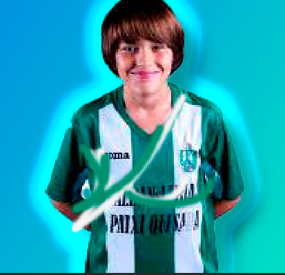

<h1>🎓 Aukeratutako Geruza Mota Baten Azalpena: Sombra paralela (Itzal Eroria)</h1>
Lanerako onena aukeratuko dut: Sombra paralela... (Photoshop-en ohikoagoa den izena Drop Shadow da, eta euskaraz Itzal Eroria deitzen zaio).

<h2>1. Geruza Mota: Sombra paralela (Drop Shadow / Itzal Eroria)</h2>
<h2>2. Zer da?</h2>
Efektu honek geruzaren edukiaren (irudi, forma edo testu) atzean eta azpian itzal bat simulatzen du. Itzal horrek norabide eta distantzia jakin bat du.

<h2>3. Zertarako erabiltzen da?</h2>
Sakontasuna sortzeko (Dar profundidad): Elementuak atzeko planoarekiko altxatuta edo hiru dimentsiotan daudela irudikatzeko modu errazena da.

Elementuak nabarmentzeko (Destacar elementos): Itzalak kontrastea gehitzen du, eta, horrela, testuak edo botoiak errazago irakurtzen eta ikusten dira.

Diseinuaren Errealismoa (Realismo): Argiztapen erreala simulatzen du, objektu batek argi-iturri baten aurrean berez sortzen duen itzala irudikatuz.

<h2>4. Ezarpen garrantzitsuenak (Parámetros clave):</h2>
Angelu (Ángulo): Itzala zein norabidetan eroriko den zehazten du (argi-iturriaren posizioa simulatuz).

Distantzia (Distancia): Geruzaren eta sortutako itzalaren arteko banaketa.

Hedapena (Extensión): Itzalaren ertzen gogortasuna edo leuntasuna kontrolatzen du.

Tamaina (Tamaño): Itzalaren lausotasuna (blur) edo zabalera. Zenbat eta handiagoa izan, orduan eta lausoagoa.

Adibidea: Web-orrialde bateko botoi bati Sombra paralela arin bat aplikatuz, sakatu daitekeen elementu fisiko baten itxura ematen zaio.