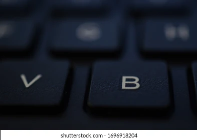
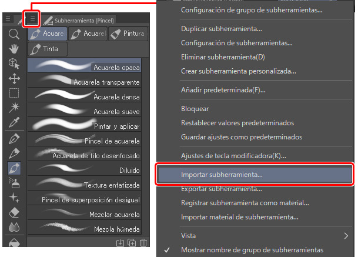

# NOLA ERABILI PHOTOSHOPEKO PINTZELAK: GIDA ESPEZIFIKOA

Tutorial honek Photoshop-eko pintsel-tresnan <b>Brush Tool</b> jartzen du arreta, haren motak eta konfigurazio-aukera nagusiak azalduz.

## 1. Pintsela Tresna Hautatu

Pintsela tresna hautatzeko, egin klik tresna-barrako ikonoan (pintsel baten itxura du) edo sakatu <b>B</b> tekla (ingelesezko "Brush" hitzetik) teklatuan.

## 2. Oinarrizko Ezarpenak (Aukeren Barra)
Pintsela tresna hautatuta dagoenean, pantailaren goialdean dagoen Aukeren Barran <b>Options Bar</b> ezarpen nagusiak ikusiko dituzu:

**Pintsela Hautatzailea <b>Brush Picker</b>:** Goiko ezkerrean dagoen gezia sakatuta, eskuragarri dituzun pintsel guztien zerrenda ikusiko duzu. Hemen tamaina <b>Size</b> eta gogortasuna <b>Hardness</b> doi ditzakezu graduatzaile batekin.
*Irudi ideala: Pintsela hautatzailearen goitibeherako menuaren pantaila-argazkia, tamaina eta gogortasun graduatzaileak ikusgai direla.*

**Tamaina <b>Size</b>:** Pintzelaren diametroa kontrolatzen du. `[` eta `]` giltzak erabiliz azkar alda dezakezu.
**Gogortasuna (<b>Hardness</b>):** Pintzelaren ertzaren leuntasuna edo zorroztasuna zehazten du. %0 gogortasunak ertz oso leuna sortzen du, eta %100ek, berriz, ertz gogorra.
**Opakutasuna `Opacity`:** Trazuaren gardentasuna kontrolatzen du. %100ean kolore trinkoa aplikatzen du; zenbat eta baxuagoa izan, orduan eta gardenagoa.
**Fluxua `Flow`:** Opakutasunaren antzekoa da, baina pinturaren "jariakortasuna" simulatzen du. Balio baxuekin, trazu batean eremu beraren gainean behin eta berriz pasatzean kolorea pilatzen joango da.

## 3. Pintsel Mota Nagusiak

Photoshop-ek lehenetsitako pintsel karpeta desberdinak dakarzki (bertsio berrietan 4 nagusi):

 **Pintsel Orokorrak `General Brushes`:** Oinarrizko pintselak dira, gehienetan borobilak. `Gogorrak` eta `Leunak` (Hard Round / Soft Round) dira ohikoenak.
  **Media Lehorrekoak `Dry Media Brushes`:** Arkatzak, ikatz-ziria eta antzeko testurak simulatzen dituzte.
 **Media Hezekoak `Wet Media Brushes`:** Akuarela, olio-pintura eta tinta bezalako efektuak sortzen dituzte.
**Efektu Berezietakoak `Special Effect Brushes`:** Zipriztinak, testurak eta eredu konplexuagoak aplikatzeko balio dute.

## 4. Konfigurazio Aurreratua (Pintsel Ezarpenen Panela)

Ezarpen aurreratu gehiago lortzeko, ireki **Pintsel Ezarpenen Panela** `Brush Settings Panel`. Aukeren Barran dagoen pintsel-formako ikonoan klik eginez edo `Leihoa` > `Pintsel Ezarpenak` `Window` > `Brush Settings` menura joanda egin dezakezu.

Panel honetan, pintselaren ia edozein ezaugarri pertsonaliza dezakezu:

  **Pintselaren Punta Forma `Brush Tip Shape`:** Pintselaren forma, tartea (`Spacing`), angelua eta biribiltasuna aldatzeko aukera ematen du. Tartea handitzeak trazu jarraitu baten ordez puntuak sortuko ditu.
  **Formaren Dinamika `Shape Dynamics`:** Tableta grafikoarekin lan egitean oso garrantzitsua. Tamainaren, angeluaren eta biribiltasunaren gorabeherak kontrolatzen ditu, presioaren arabera aldatzeko aukera emanez `Size Jitter`, `Angle Jitter`.
  **Sakabanaketa (`Scattering`):** Pintzelaren markak trazuaren ibilbidetik zehar eta hortik kanpo sakabanatzen ditu.

  **Transferentzia `Transfer` - batzuetan `Other Dynamics` deitua:** Trazuaren opakutasuna eta fluxua presioaren arabera (edo beste kontrol batzuen arabera) aldatzeko aukera ematen du. Hau funtsezkoa da marrazketa naturala lortzeko.
    
