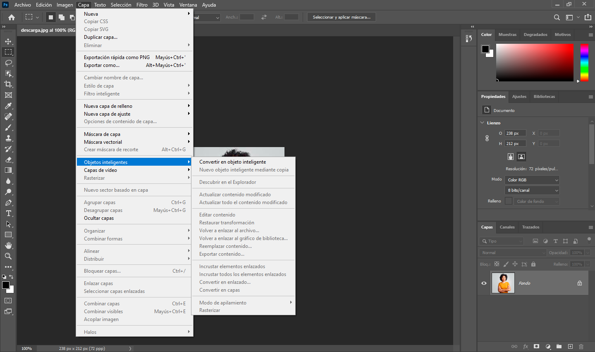
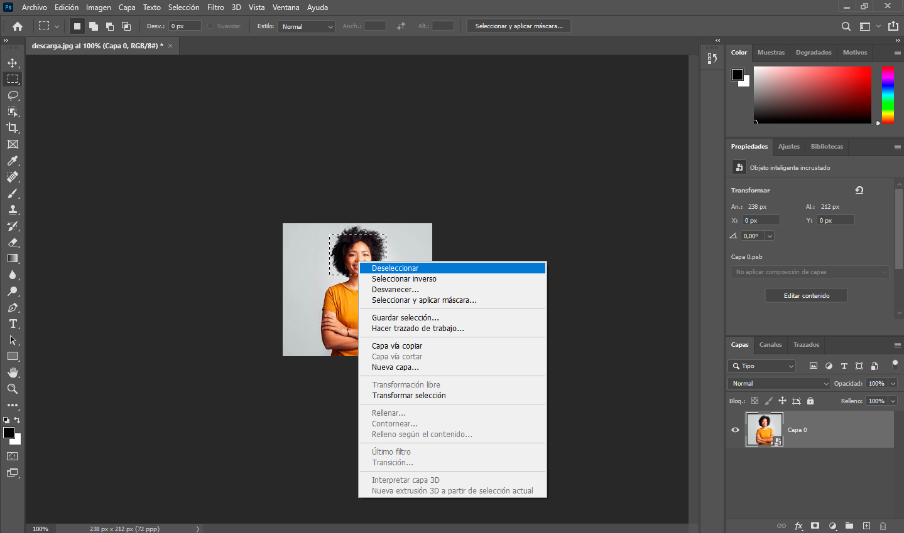

**Usar un Objeto Inteligente (Smart Object) en Photoshop es fácil y muy útil: seleccionas la capa, le das clic derecho y eliges "Convertir en Objeto Inteligente" (o usas Ctrl+T para transformar) para que puedas redimensionar, aplicar filtros y hacer transformaciones sin dañar la calidad original, ya que se edita de forma no destructiva, guardando la información original dentro de un contenedor que permite ajustes posteriores en cualquier momento sin pérdida de calidad.**
# ¿Cómo crear un Objeto Inteligente?
## 1.Selecciona la capa: En el panel "Capas", selecciona la imagen, texto o grupo que quieras convertir. 

## 2.Haz clic derecho: Haz clic derecho sobre la capa seleccionada.

## 3.Elige la opción: Selecciona "Convertir en Objeto Inteligente" (o "Convert to Smart Object").
## 3.Verifica: Verás un pequeño icono de miniatura en la esquina de la capa, indicando que es un Objeto Inteligente. 

# ¿Cómo se usa?
**Transformaciones no destructivas:** Redimensiona, rota o inclina el objeto (Ctrl+T) cuantas veces quieras; la calidad original se mantiene.
Filtros Inteligentes: Aplica filtros (como Desenfoque, Ruido, etc.) desde Filtro > Filtros Inteligentes. Estos se listan debajo de la capa y puedes editarlos, borrarlos o cambiar su orden en cualquier momento.
**Edición de contenido:** Haz doble clic en la miniatura del Objeto Inteligente para abrir el archivo original en una nueva pestaña. Edita, guarda y se actualizará automáticamente en tu proyecto principal, conservando los filtros aplicados.
**Mocups (Diseños en productos):** Útil para colocar un diseño en una superficie curva (como una taza). Creas un rectángulo, lo conviertes en Objeto Inteligente, lo deformas a la curva y editas el contenido dentro para ver el diseño impreso. 

# Beneficios clave
**No destructivo:** Protege tu imagen original de cualquier modificación permanente.
**Flexibilidad:** Permite experimentar con filtros y transformaciones sin temor a arruinar la calidad.
**Edición centralizada:** Si usas objetos enlazados, un cambio en el archivo fuente se refleja en todos los documentos. 