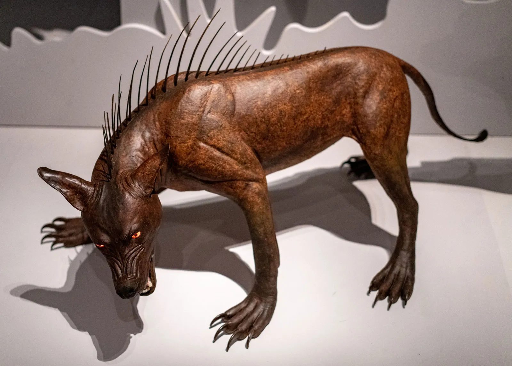
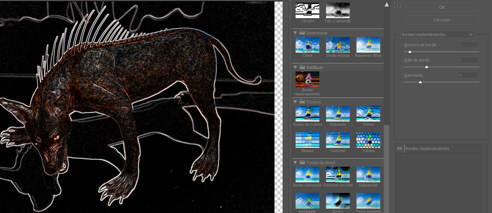
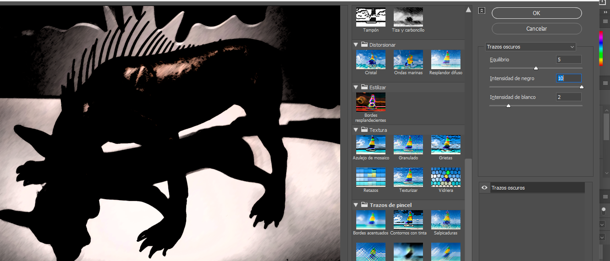
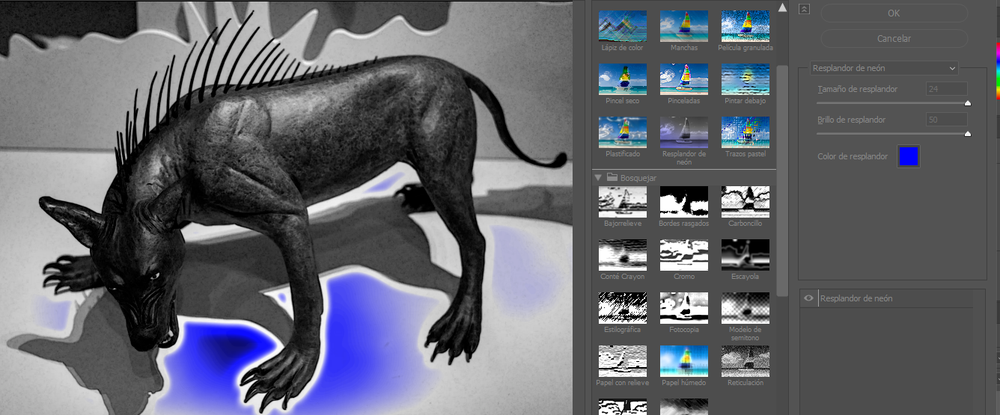
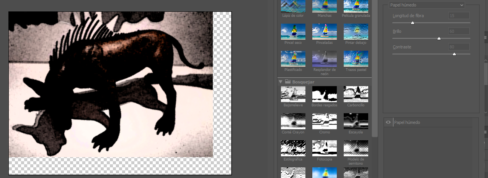
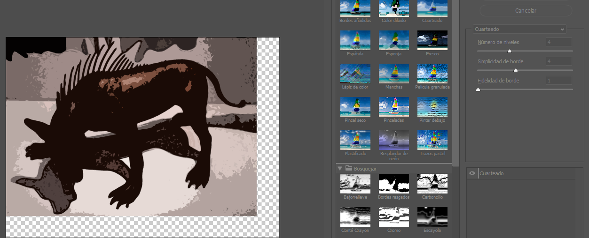

# Photoshop Filtroak
- [Photoshop Filtroak](#photoshop-filtroak)
    - [Asalduko dut nola erabili filtro batzuk](#asalduko-dut-nola-erabili-filtro-batzuk)
    - [Bordes resplandecientes](#bordes-resplandecientes)
    - [Trazos oscuros](#trazos-oscuros)
    - [Resplandor de neon](#resplandor-de-neon)
    - [Papel humedo](#papel-humedo)
    - [Cuarteado](#cuarteado)
        - [Nondik atera dudan argazkia Chupacabras](#nondik-atera-dudan-argazkia-chupacabras)

###  Asalduko dut nola erabili filtro batzuk

1. Bordes resplandecientes
2. Trazos oscuros
3. Resplandor de neon
4. Papel húmedo
5. Cuarteado

### Bordes resplandecientes

1. (Anchura de borde) Detektatutako ertzetan sortzen diren lerro distiratsuen lodiera kontrolatzen du. Balio altuago batek lerroak lodiagoak egiten ditu.

2. (Brillo de borde) Distiraren intentsitatea edo argitasuna doitzen du. Balio altu batek efektua biziagoa eta ikusgarriagoa egiten du.

3. (Suavizado) Ertz distiratsuen leuntasuna edo xehetasun maila zehazten du. Balio altu batek ertzak gehiago leuntzen ditu eta irudia sinplifikatu dezake, eta balio baxu batek, berriz, xehetasun finagoak mantentzen ditu.

### Trazos oscuros

1. (Equilibrio) Doikuntza honek trazo ilun eta argien arteko oreka zehazten du. Erakusten den "5" bezalako balio batek nahasketa orekatu bat adierazten du; balio altuagoek trazo zuri/argiak faboratuko lituzkete, eta baxuagoek, berriz, trazo ilunak.

2.(Intensidad de negro) beltza (Black Intensity): Trazo beltzen xehetasun eta opakutasun maila kontrolatzen du. Balio altu batek xehetasun ilunak nabarmenagoak eta definituagoak egiten ditu, irudian "10" balioarekin iradokitzen den bezala.

3.(Intensidad de blanco) Aurrekoaren antzekoa da, baina trazo zurientzat. Gune argien xehetasuna eta opakutasuna kontrolatzen ditu. "2" balioak iradokitzen du gune argien xehetasunak ez direla hain nabarmenak, edo sotilagoak direla egungo konfigurazioan.

### Resplandor de neon

 1.(Equilibrio) Honek detektatutako ertzetan sortzen diren lerro distiratsuen lodiera kontrolatzen du.

   2.(Brillo de resplandor) Honek neonezko distiraren intentsitatea doitzen du, efektua ikusgarriago eginez.

   3.(Color de resplandor) iragazkiak irudiaren inguruneetan automatikoki aplikatuko duen neonezko distiraren tonu eta saturazio zehatza definitzeko aukera ematen duena, efektu bisuala erabat pertsonalizatuz.
 
### Papel humedo

1.(Longitud fibra) Argiuneak leuntzen ditu eta lerro gisa koadro ilunak gehitzen ditu, paper testuratuaren gainean akuarela-pintura simulatuz.

2.(Brillo)  Irudiaren argitasun orokorra doitzen du.

3 . (Contraste)  Eremu argi eta ilunen arteko aldea areagotzen du. 

### Cuarteado

1.(Número de niveles)  Irudian agertuko den kolore kantitate osoa kontrolatzen du. Balio baxu batek kolore gutxiago erabiltzen ditu, eta efektu "kuarteatuagoa" edo sinpleagoa sortzen du.

2.(Simplicidad de bordes)  Ertzak zein konplexuak diren zehazten du. Balio altu batek ertz leun eta sinpleagoak sortzen ditu, eta balio baxu batek, berriz, xehetasun fin asko mantentzen ditu.

3.(Fidealidad de bordes) Jatorrizko irudiaren ertzak zein ondo errespetatzen diren kontrolatzen du. Balio altu batek ertzak jatorrizko itxuratik hurbilago mantentzen ditu, eta balio baxu batek, berriz, askoz gehiago sinplifikatzen ditu.

##### Nondik atera dudan argazkia [Chupacabras](https://cdn.britannica.com/86/216786-050-022DB6BF/Model-chupacabra-exhibit-Bloodsuckers-Legends-to-Leeches-Royal-Ontario-Museum-Toronto.jpg)

Eskerrikasko irakurztea gahitik,

**Oihan** 
=======

